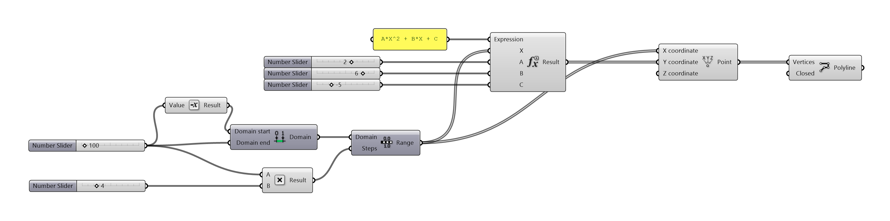

# Matemática das Simulações

1. Equações e Resultados
2. Tratando os Resultados
3. Otimização
    1. Otimização qualitativa x otimização quantitativa
    2. Parâmetros
    3. Função Objetivo

## Ponto se movendo como uma parábola.

## Criando a curva de uma parábola

## Tratando a curva - qual o valor ideal? 

### [arquivo parábola](../Arquivos/Arquivos_Parte_I/Funcao_objetivo_v2.gh)

________________________
________________________

