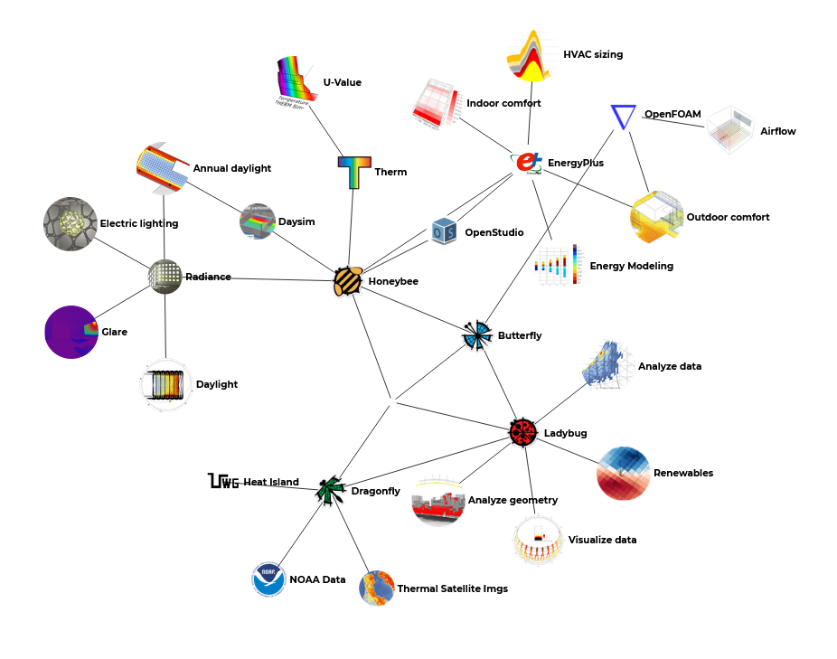
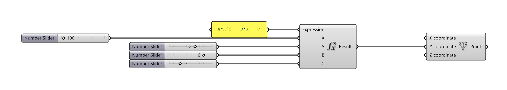

# Projeto e Simulação

1. Todo projeto é uma simulação.
2. O aspecto computacional do BIM é um ramo da simulação computacional.
3. Dimensões do BIM: diferentes aplicações do modelo, diferentes simulações.

________________________
________________________

## Ferramtentas de Simulação para a Construção

### O formato IFC

1. [Building Smart](https://www.buildingsmart.org/)
    

### Simulação de Estruturas

1. [Tekla Structures](https://www.tekla.com/br/produtos/tekla-structures)
2. [TQS](http://www.tqs.com.br/)
3. [Autodesk Robot Structural Analysis](https://www.autodesk.com/products/robot-structural-analysis/overview)

###  Simulação de Processos

1. [Navisworks](https://www.autodesk.com.br/products/navisworks/overview)

### Simulação de fluxo

1. [Varade](http://www.vadere.org)

    

### Simulação Histórica

1. HBIM

### Simulação energética
1. [Energy Plus](https://energyplus.net/)
    

1. [Radiance](https://www.radiance-online.org/)
    

1. [Daysim](http://daysim.ning.com/)
    

1. [Open Studio](https://www.openstudio.net/)
    

1. [Ladybug Tools](https://www.ladybug.tools)
   

________________________
________________________

## Matemática das Simulações

1. Equações e Resultados
2. Tratando os Resultados
3. Otimização
    1. Otimização qualitativa x otimização quantitativa
    2. Parâmetros
    3. Função Objetivo

### Ponto se movendo como uma parábola.

### Criando a curva de uma parábola

### Tratando a curva - qual o valor ideal? 

#### [arquivo parábola](../Arquivos/Arquivos_Parte_I/Funcao_objetivo_v2.gh)

________________________
________________________

