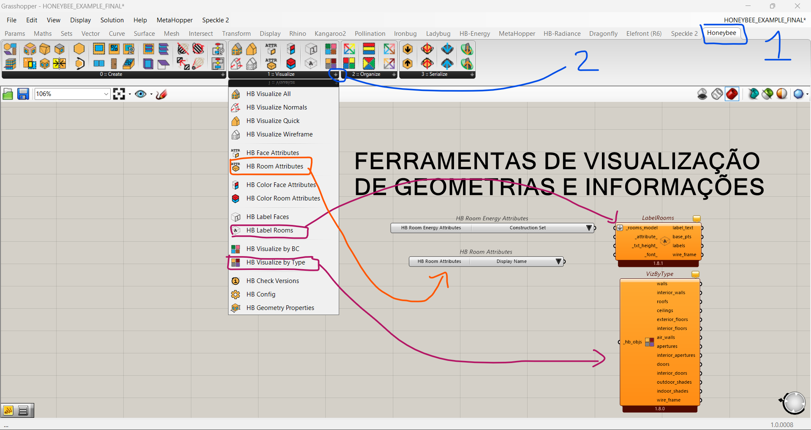
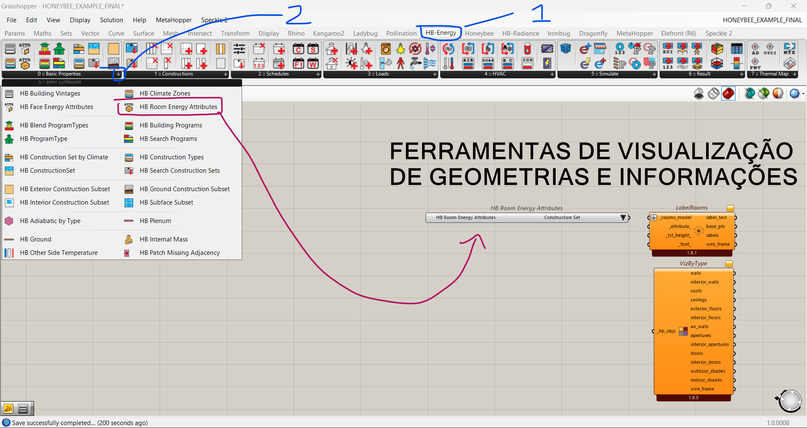

# Introcução ao Honeybee

## Exercício 01

[Arquivos iniciais](HB_101_assets/HONEYBEE_EXAMPLE.zip)

------------------
-------------------
### Componentes utilizados:

#### Ferramentas de visualização utilizadas:

-----------

-----------

#### Ferramentas de criação dos objetos:

 

-----------

-----------

#### Agregando iformações ao modelo:

-----------

-----------

-----------

-----------

#### Criando um modelo para análise (com entorno e informações)

 
 
-----------

#### Configurando a simulação

-----------

#### Avaliando os resultados:

 

-------------------
-------------------

## Arquivo final

[Arquivo final](HB_101_assets/HONEYBEE_EXAMPLE_FINAL.gh)