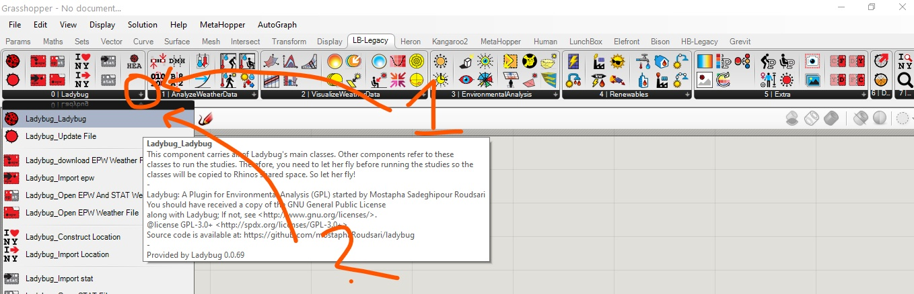
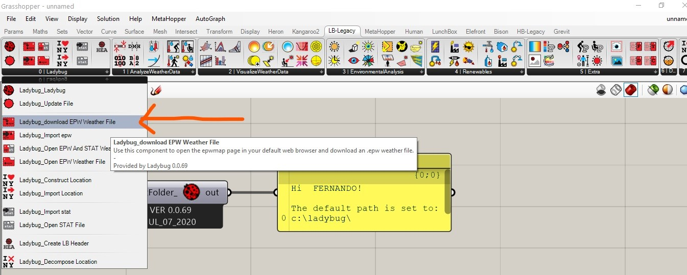
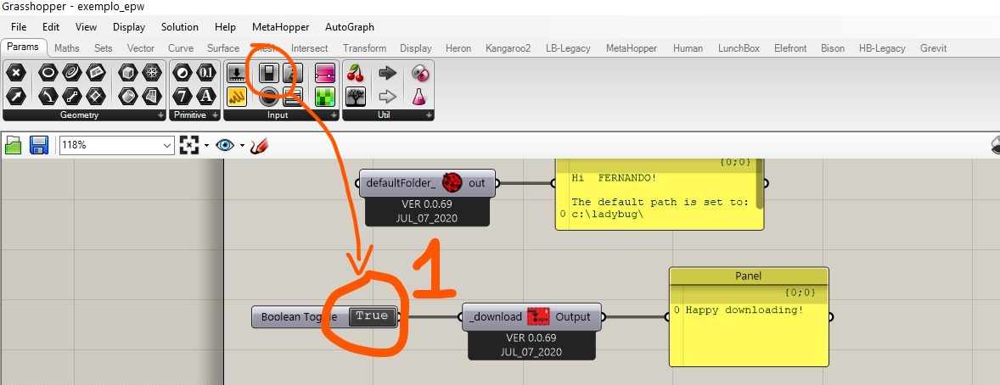
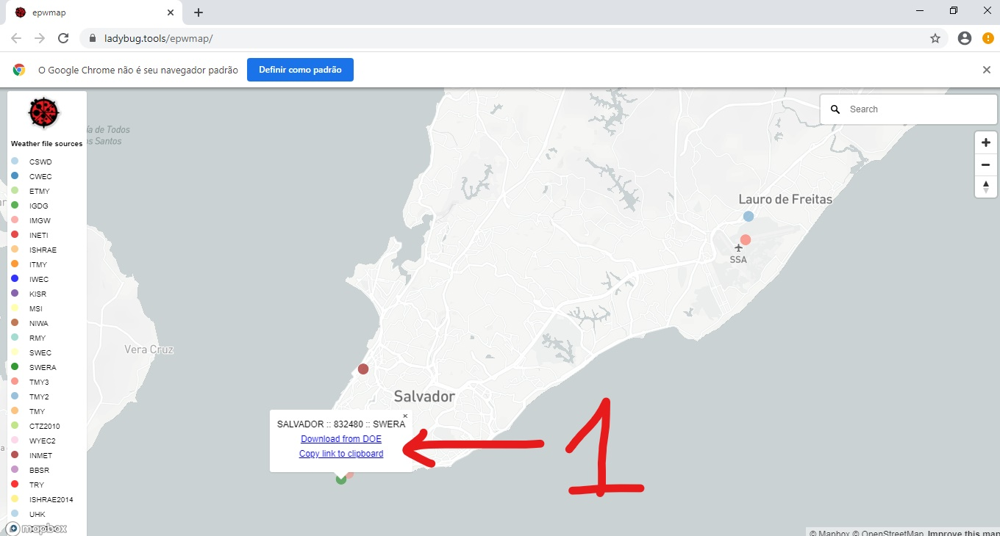
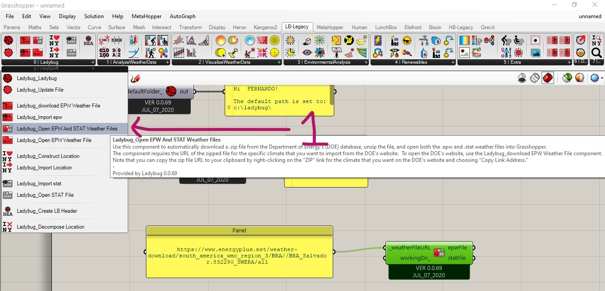
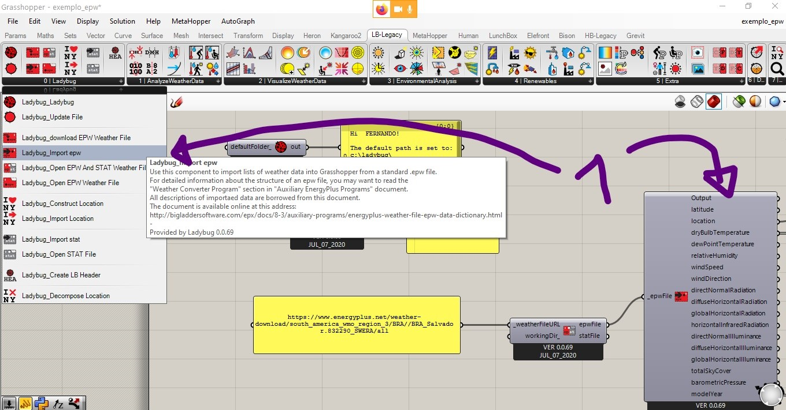
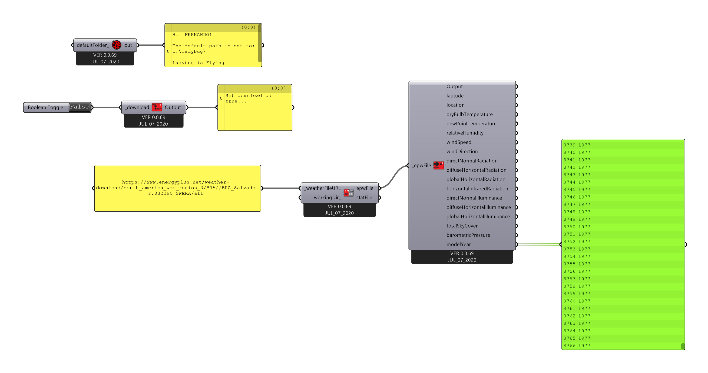

# Arquivos EPW

[Sobre os arquivos do EPW Energy Plus](https://energyplus.net/weather/simulation)

## Componente Principal do Ladybug (Ladybug_Ladybug)

## Baixando Arquivos EPW

### Use o componente de Download

### Use um Boolean Toggle 

### Procure as estações mais próximas da localidade do seu estudo climático.

#### Cleque em cima da estação desejada e escolha a aopção que copia o link

#### IMPORTANTE! Lembre-se de desativar o conector booleano depois de copiar o caminho do arquivo

### Copie o link em um painel do Grasshopper. Use o painel como entrada para o componente Open EPW and STAT Weather File 

### O componete Import EPW torna as informações do arquivo disponíveis para manipulação no Grasshopper

### Configuração final

[arquivo final](./ladybug_epw.gh)

### Vamos olhar as características de alguns arquivos EPW da cidade escolhida para o projeto.

