# Rosa dos Ventos

Partindo do [arquivo final](../epw_arq/ladybug_epw.gh) do guia [Baixando Arquivos EPW e importando dados](../epw_arq/ladybug_epw.md).

Selecione o componente **Ladybug_Wind Rose**.

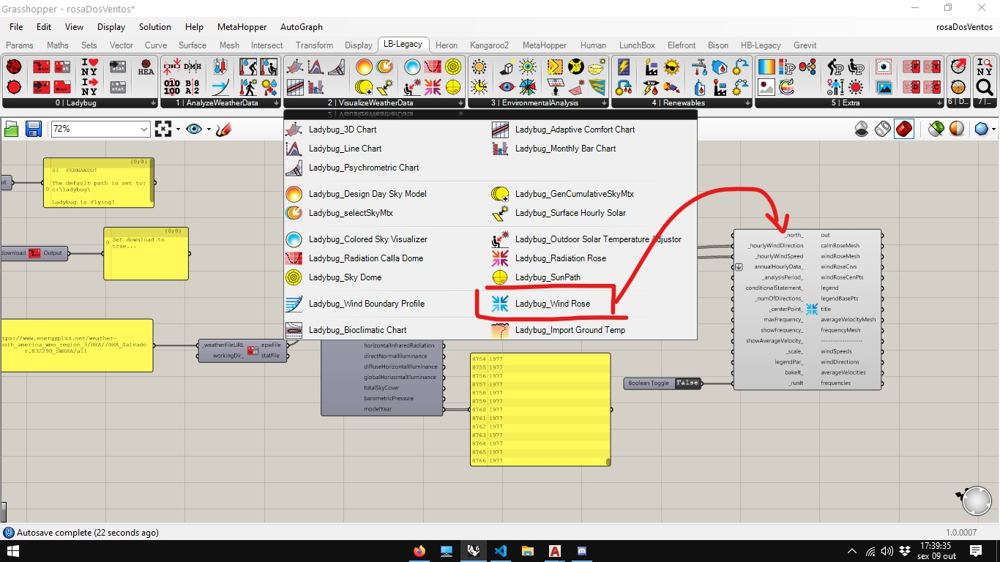

Conecte as saídas **windDirection** e **windSpeed** nas entradas correspondentes. Conecte um **Boolean Toggle** na entrada **_runit** e, com um duplo clique no texto **False**, mude o valor para **True**.

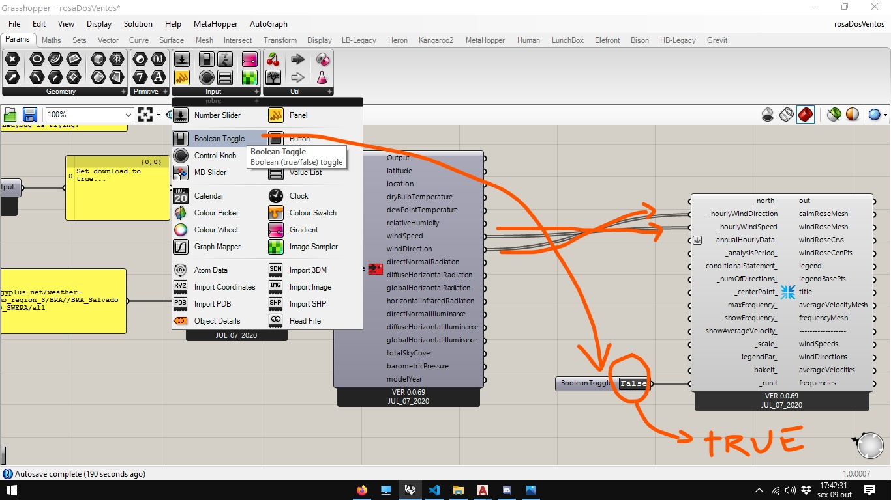

Um diagrama da rosa dos ventos aparece. A escala de cores indica a velociade do vento em m/s, conforme os valores indicados.

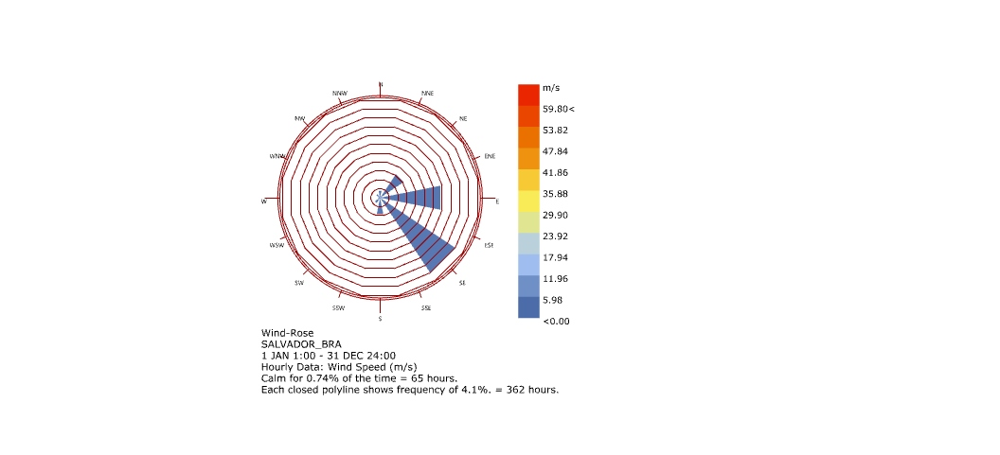

É possível adicionar um outro conjunto de dados no gráfico da rosa dos ventos. Na figura abaixo, inserimos a saída de **dryBulbTemperature** do arquivo EPW na entrada **annualHourlyData_**

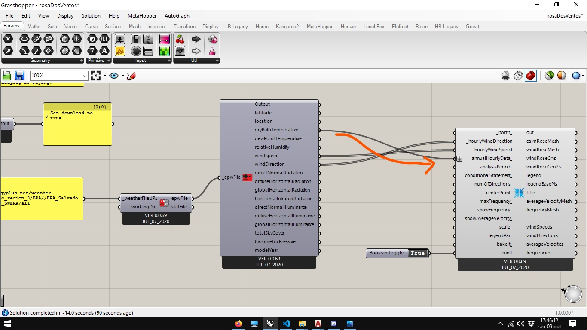

Agora duas imagens aparecem na viewport do rhinoceros, as duas tem a mesma forma, indicando a intensidade do vento. Na figura da direita, as cores agora indicam a Temperatura, conforme indicado na legenda.

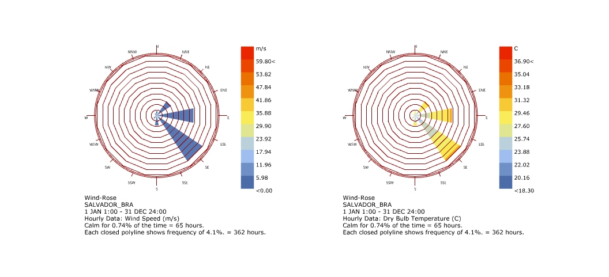

O componente **Ladybug_ Analisys Period** pode ser utilizado em diversos componentes do Add-on. É usado para filter os dados para um períodoespecífico

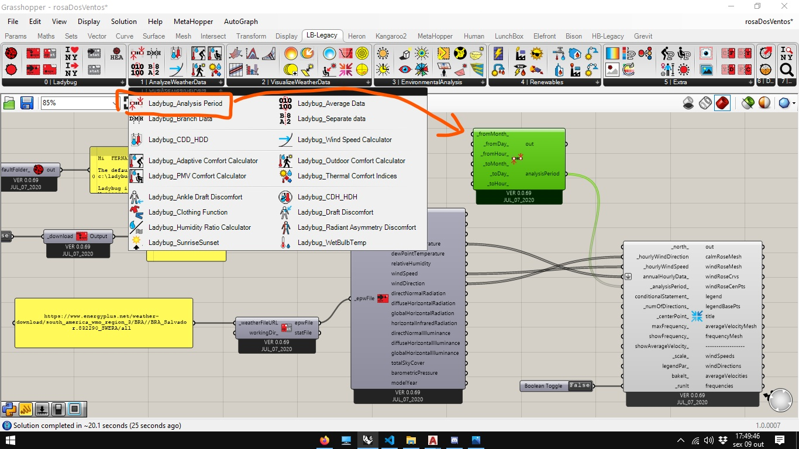

Utilizando **Sliders** entre 1 e 12 para os meses, entre 1 e 31 para os dias e entre 1 e 24 par as horas.

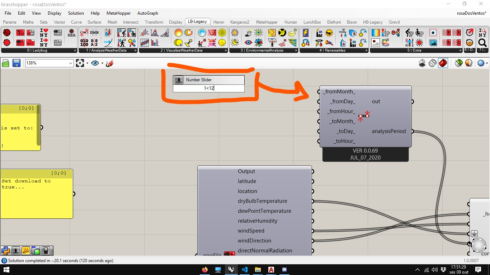

O período do verão pode ser analisado, restringindo o período do dia 21/12 até o dia 21/03. 

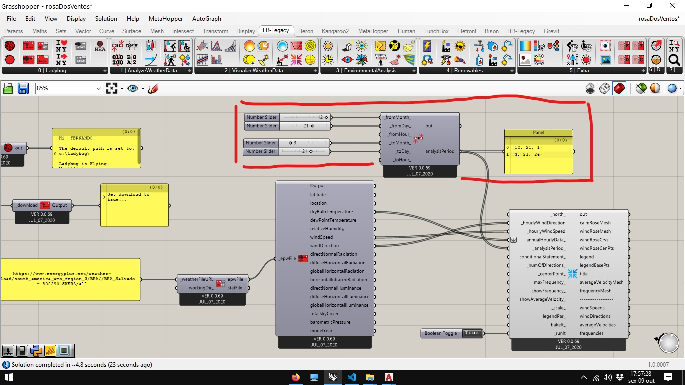

Comparando com o gráfico anterior, vemos variações na lagenda mais significativas do que nas formas do gráfico.

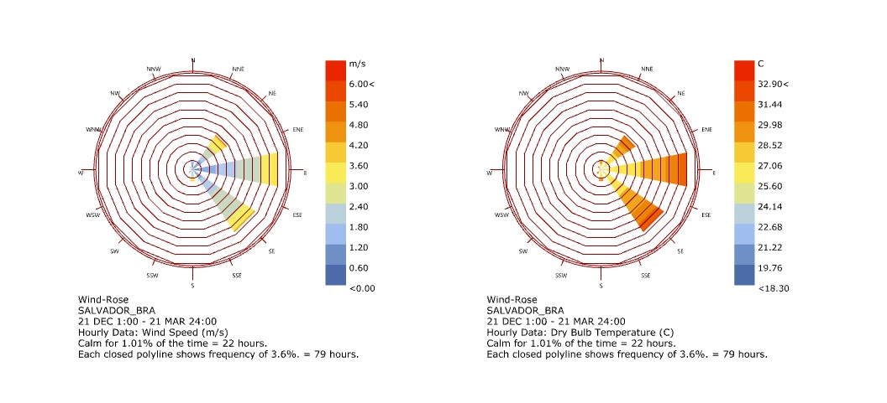

[arquivo final](./rosaDosVentos.gh)

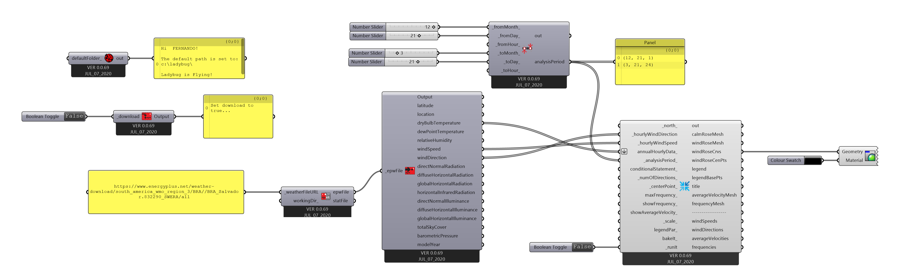

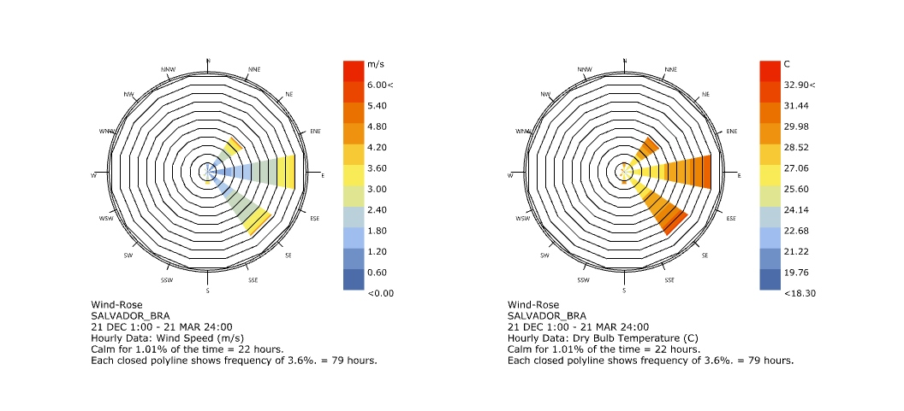