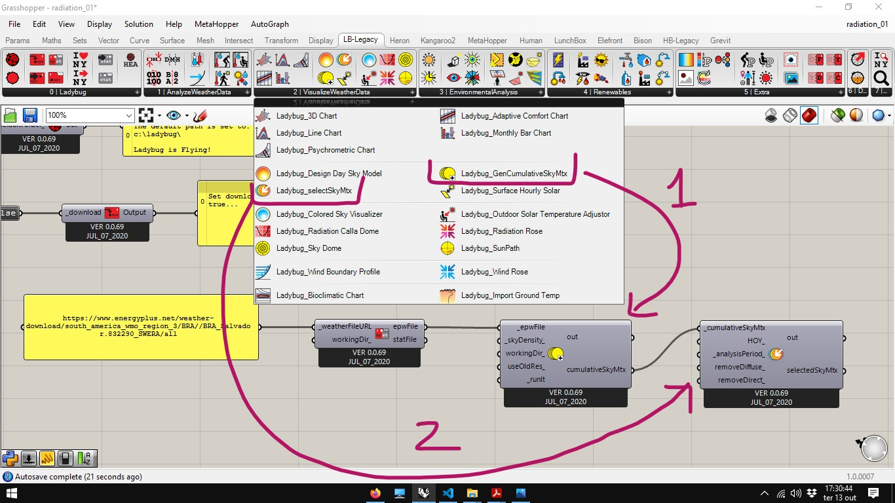
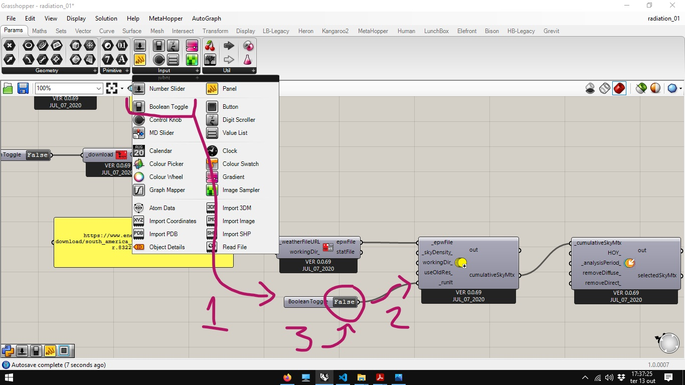
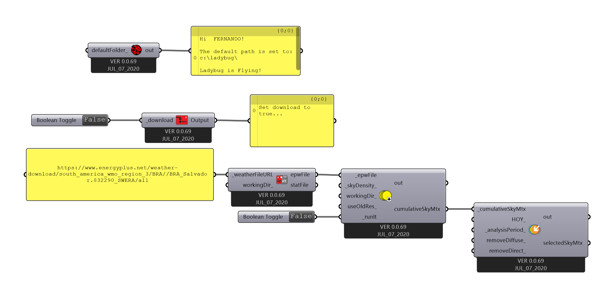

# Arquivo base para análise de radiação solar

Partindo do [arquivo final](../epw_arq/ladybug_epw.gh) do guia [Baixando Arquivos EPW e importando dados](../epw_arq/ladybug_epw.md).

Abra o Arquivo indicado. Selecione os componentes **ladybug_import epw** e o painel associado e apague (tecla delete).

Os dois componentes mais utilizados na análise de radiação solar são o **LadYbug_GenCumulativeSkyMtx** e o **Ladybug_SelectSkyMtx**. eles devem ser conectados conforme imagem abaixo:

Para calcular a Sky Matrix, conecte um componente **Boolean Toggle** na entrada **_runIt** do componente **LadYbug_GenCumulativeSkyMtx**.

Esse arquivo será usado por outros guias sobre análise de radiação solar. Para Visualizar a Sky Matrix gerada, consulte o guia [skydome](./skydome.md)

__________________
__________________

[Arquivo Final](./radiation_01.gh)

