# Radiation Rose

Partindo do [arquivo final](./radiation_01.gh) do guia [Arquivo base para análise de radiação solar](./radiation.md). Utilizando o arquivo do [RADIATION_EXEMPLO.3dm](./RADIATION_EXEMPLO.3dm).

Abrindo o arquivo [radiation_01.gh](./radiation_01.gh), utilize o componente **Ladybug_Radiation Rose** conforme indicado na figura abaixo.
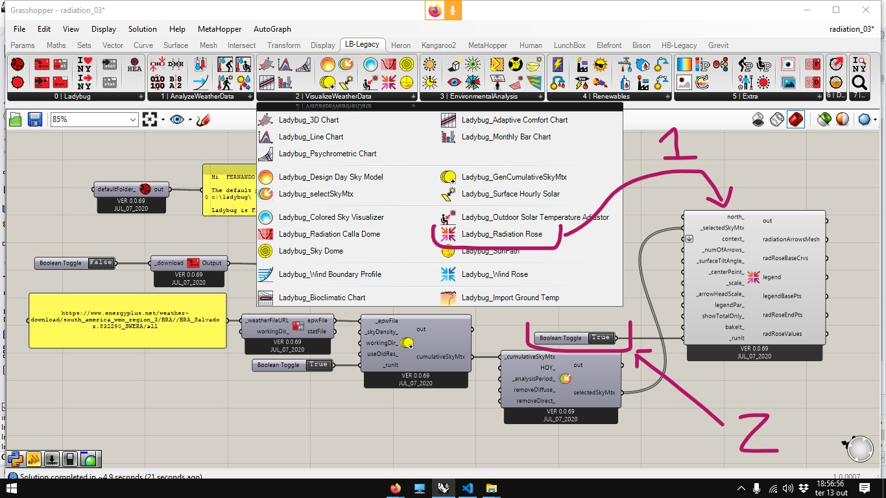

Três diguras indicando a origem dos raios de radiação são apresentadas. Da esquerda para a direita temos: radiação total, difusa e direta.

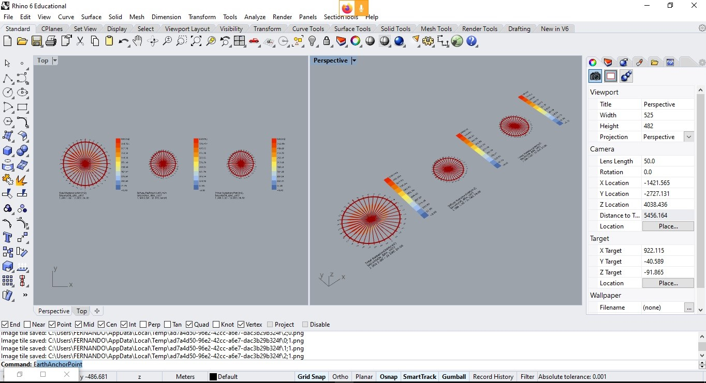

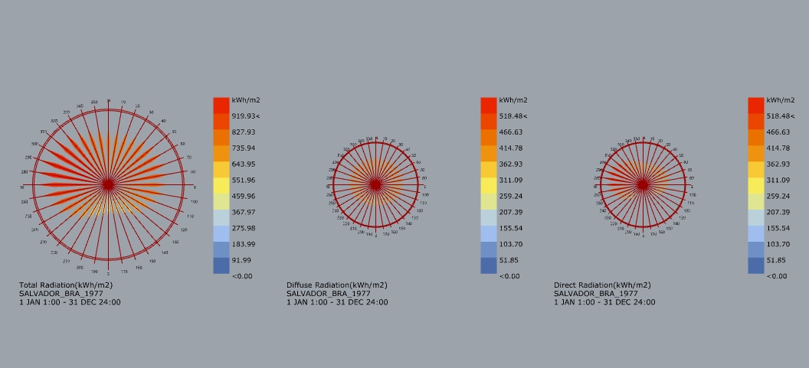

Em um projeto real, seria interessante colocar a direção do norte e levar em consideração o entorno nas análises.

Vamos usar o arquivo [RADIATION_EXEMPLO.3dm](./RADIATION_EXEMPLO.3dm) como modelo de entorno. No layer L_NORTE, está desenhada uma linha que indica a direção do norte do desenho. Os componentes utilizados para ajustar o norte são so mesmos utilizados no guia [Análise de horas de insolejamento](../sunpath/Analise_horas_de_sol.md)

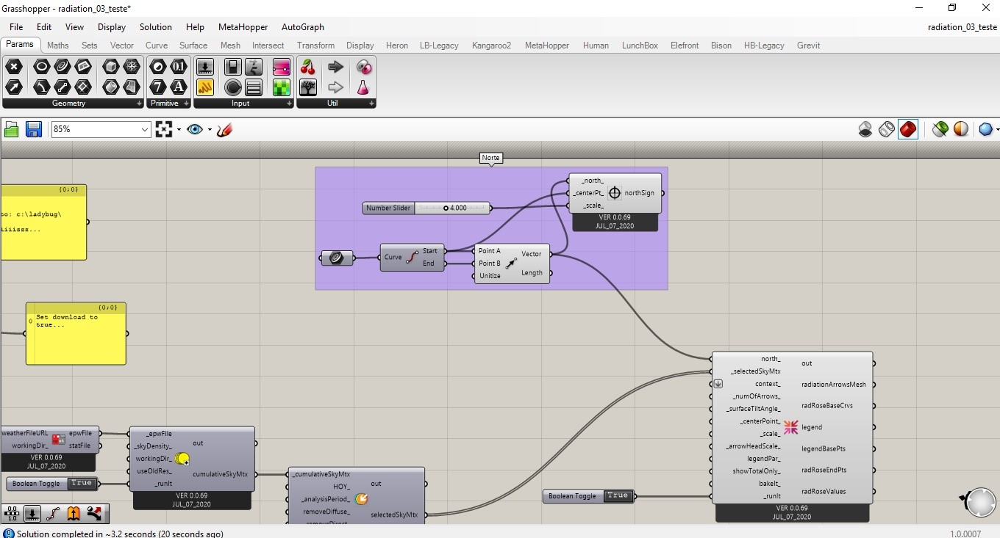

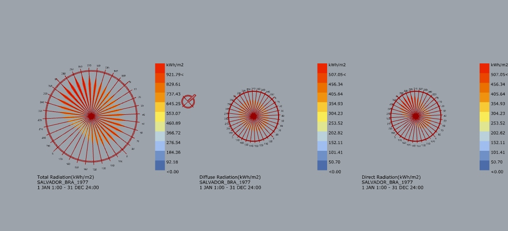

Também pode-se levar em conta a existência de elementos do entorno que formariam barreiras para a radiação solar.

Utilize um componente **Brep** e selecione os elementos do Layer Contexto, conforme indicado no guia [Análise de horas de insolejamento](../sunpath/Analise_horas_de_sol.md)

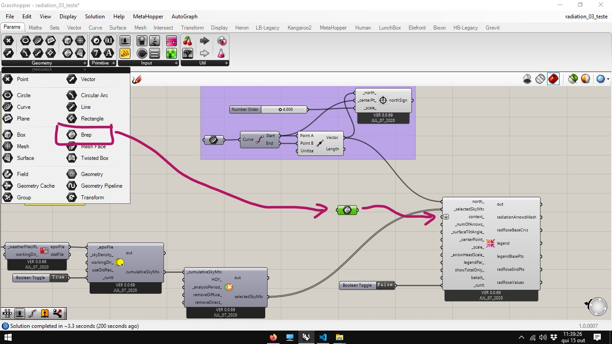

É possível observar a queda nos valores de radiação solar após alimentar o algoritmo com o contexto.

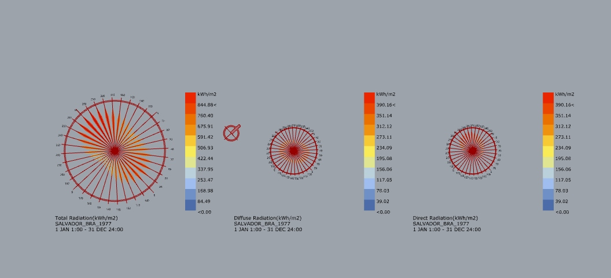

Observando a saída **radRosValues** com um painel ou um componente **ParamViewer** vemos que tratam-se de 3 um conjunto de 3 listas contendo 36 valores cada. Cada lista contem os valores provenientes de direções a cada 10 graus, da radiação total, difusa e direta. 

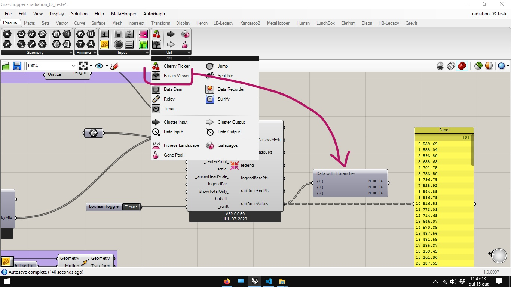

É possível obter a soma das 3 radiações com um componente **MassAdition**.

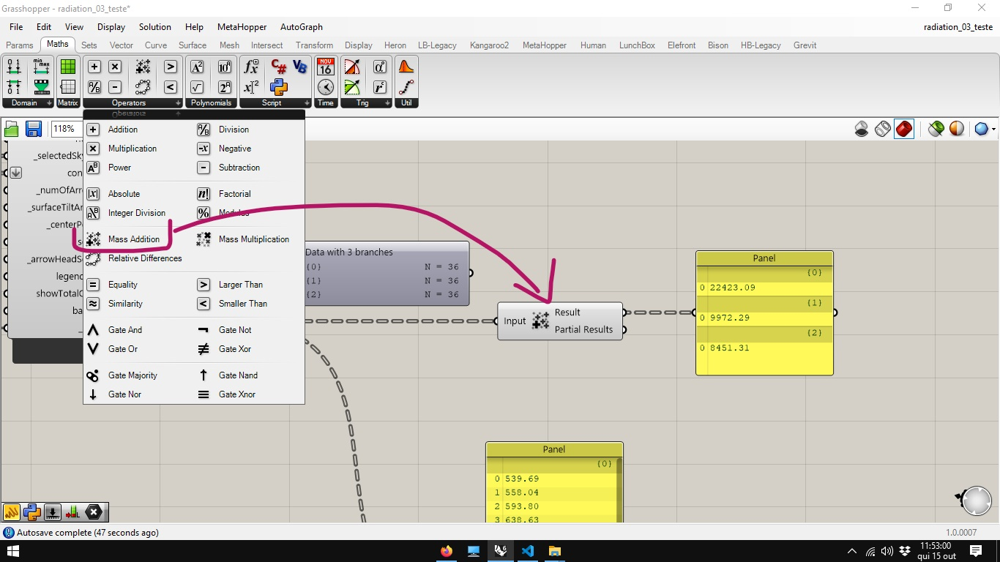

O tratamento dos dados ilustrado abaixo foi feito para mostrar a diferença entra a soma dos valores da radiação difusa e direta em relação a radiação total, quando exixtem elementos do entorno funcionando como barreiras.

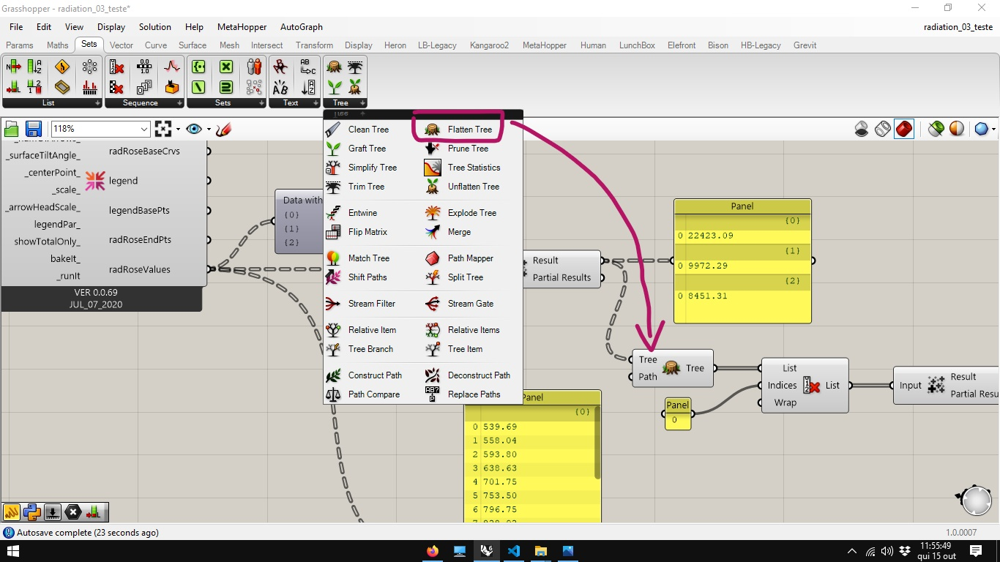

A diferença corresponde à radiação total barrada.

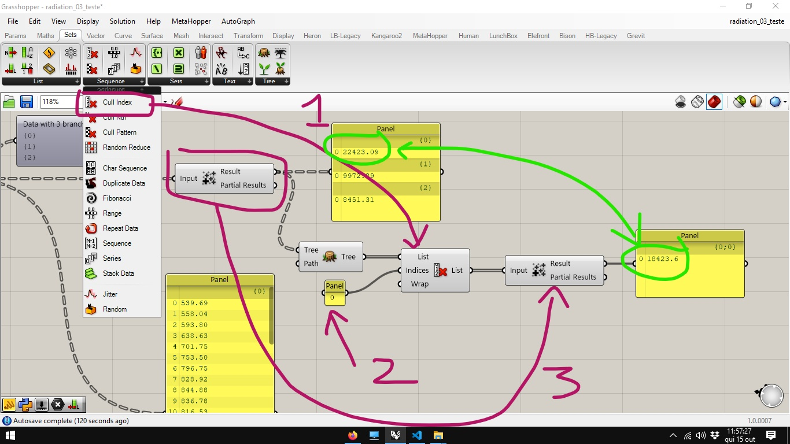

Existe uma configuração de ponto central (entrada **_centerPoint_** no componente **Ladybug_Radiation Rose** onde á radiação é medida. Caso nenhum valor seja fornecido, adota-se o ponto de corrdenadas 0,0,0 para as medições.

A altura em relação as barreiras também é importante. para comprovar, clique duas vezesna tela e digite 0,0,0 e aperte enter. Isso ira criar um componente **Point** no centro do sistema de coordenadas.

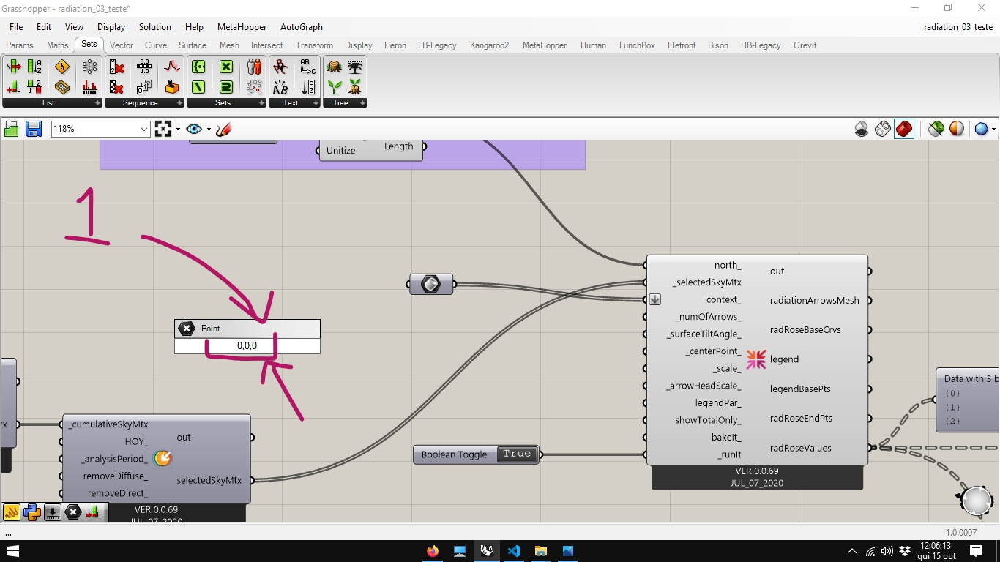

Para Mover o ponto gradativamente acima das barreiras, podemos utilizar um componente **Move**.

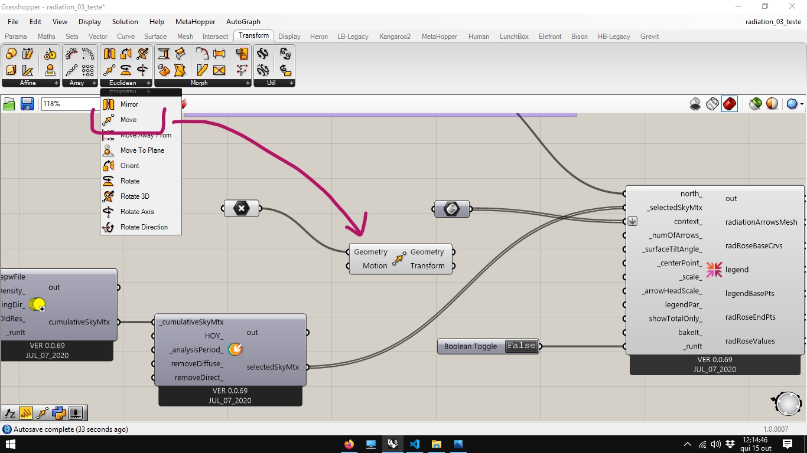

Inserimos na entrada **Motion** um versor Z. e um slider que varie de 0 a 200. Conecte o conjunto à entrada **_centerPoint_** conforme ilustração abaixo.

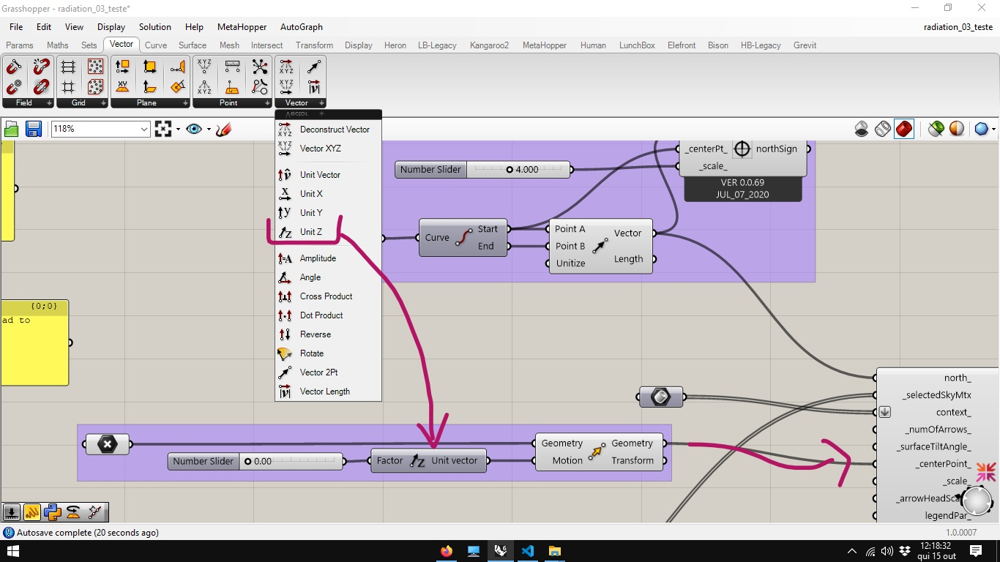

Mova o slider para cima e reative a entrada **_runIt_** do componente **Ladybug_Radiation Rose**. Aquanto mais alto o valor do slider , mas distante a área de influência das barreiras, mais próximos será a soma dos valores das radiações difusa e direta do valor da radiação solar total.

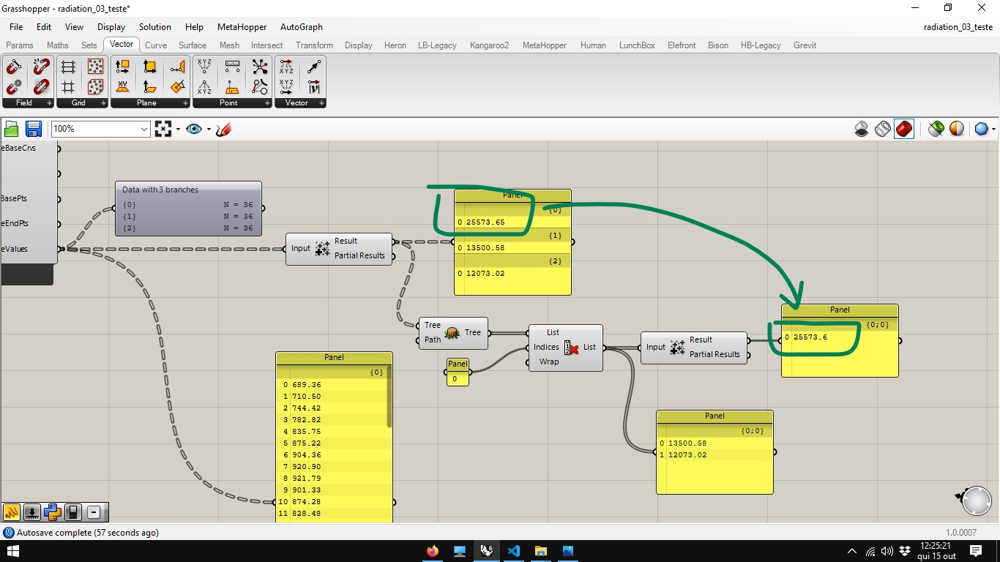
_______________________________________
_______________________________________
[Arquivo final](./radiation_03.gh)

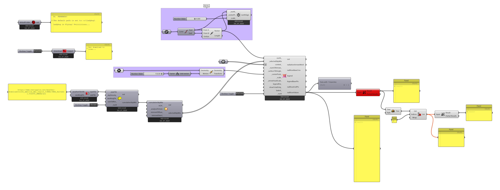

