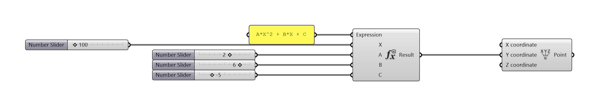
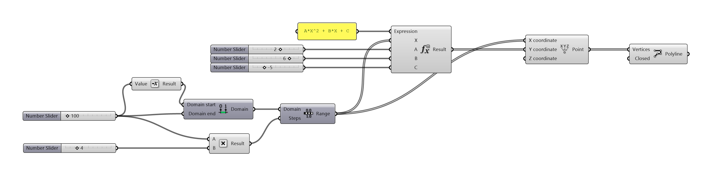

# Ferramentas de Simulação em Modelos Paramétricos

_______

## MBI BIM | SENAI-CIMATEC | 2020

### Prof. Fernando Ferraz Ribeiro | ffribeiro@gmail.com

_______

### [Edital de Avaliação](./edital/readme.md)

_______
_______

## Parte I

### [Simulação e Bim - Conceitos](./Conceitos/readme.md)

1. Conceito de BIM
1. Conceito de Simulação Computacional
1. Conceito de Otimização

### Projeto e Simulação

1. Todo projeto é uma simulação.
1. O aspecto computacional do BIM é um ramo da simulação computacional.
1. Dimensões do BIM: diferentes aplicações do modelo, diferentes simulações.

### Matemática das Simulações

1. Equações e Resultados
1. Tratando os Resultados
1. Otimização
    1. Otimização qualitativa x otimização quantitativa
    1. Parâmetros
    1. Função Objetivo

###### Ponto se movendo como uma parábola.

###### Criando a curva de uma parábola

###### Tratando a curva - qual o valor ideal? 

[arquivo parábola](./Arquivos/Arquivos_Parte_I/Funcao_objetivo_v2.gh)

### Ferramtentas de Simulação para a Construção

1. O formato IFC

    1. [Building Smart](https://www.buildingsmart.org/)
    

1. Simulação de Estruturas

    1. [Tekla Structures](https://www.tekla.com/br/produtos/tekla-structures)
    1. [TQS](http://www.tqs.com.br/)
    1. [Autodesk Robot Structural Analysis](https://www.autodesk.com/products/robot-structural-analysis/overview)

1. Simulação de Processos

    1. [Navisworks](https://www.autodesk.com.br/products/navisworks/overview)

1. Simulação de fluxo

    [Varade](http://www.vadere.org)

    

1. Simulação Histórica
    1. HBIM

1. Simulação energética
    1. [Energy Plus](https://energyplus.net/)
    

    1. [Radiance](https://www.radiance-online.org/)
    

    1. [Daysim](http://daysim.ning.com/)
    

    1. [Open Studio](https://www.openstudio.net/)
    

    1. [Ladybug Tools](https://www.ladybug.tools)
   
    

### Instalação: Ladybug + Honebee

[Ladybug tools Download](https://www.food4rhino.com/app/ladybug-tools)

[Instruções de instalação](https://github.com/mostaphaRoudsari/ladybug/wiki/Installation-Instructions)

[Sobre a versão *legacy* 2020](https://discourse.ladybug.tools/t/legacy-ladybug-0-0-69-honeybee-0-0-66-and-honeybee-0-0-06-release/10280)

### Interface básica Ladybug tools

[guia de interface](./interface_basica/interface_basica.md)

1. Ambiente de trabalho
    1. Componente LadyBug_LadyBug
    1. Análise de conforto térmico (exterior)
    1. Temperatura de bulbo seco
    1. Sensação Térmica (Universal Thermal Climate Index)
    1. Visualização da informação
    1. *run_it*
    1. manequim
   
    

### Salvando Imagens das telas do Rhinoceros e do grasshopper

[guia de geração de imagens raster](./print_view/print_de_viewport.md)
1. Salvando Imagens da viewport do Rhinoceros
2. Salvando algoritmos do Grasshopper

### Trabalhado com arquivos EPW

1. [Baixando Arquivos EPW e Importando os Dados](./epw_arq/ladybug_epw.md)

2. [Avaliação inicial dos dados do arquivo](./epw_arq/epw_avaliando.md)

### Gráficos de Temperatura e Ventos

[Gráficos de Linhas](./graficos_temp_um_vent/Grafico_de_linhas.md)

[Mapa de calor](./graficos_temp_um_vent/heatmap.md)

Rosa dos ventos

Percurso aparente do Sol

[Movimento anual do sol](http://www.if.ufrgs.br/fis02001/aulas/aula_movsol.htm)

### Análise de insolejamento

#### Fontes de informação

[Hydra](https://hydrashare.github.io/hydra/)

[Tutoriais Chris Mackey](https://www.youtube.com/playlist?list=PLruLh1AdY-Sho45_D4BV1HKcIz7oVmZ8v)

[EPWMAP](https://www.ladybug.tools/epwmap/)

_______
_______

## Parte II

1. Simulação, construção e projetos

1. Modelagem da Informação da Cidade - City Information Modeling

1. IOT Internet of Things

1. IOT e BIM

1. Ciência de Dados

1. Ciência de dados e ambiente construido

    1. IOT
    1. Big Data
    1. Vizualização de Dados
    1. Exemplos de aplicação

1. Orientação do Trabalho Prático

1. Interoperabilidade entre sistemas paramétricos

1. Encerramento do curso
