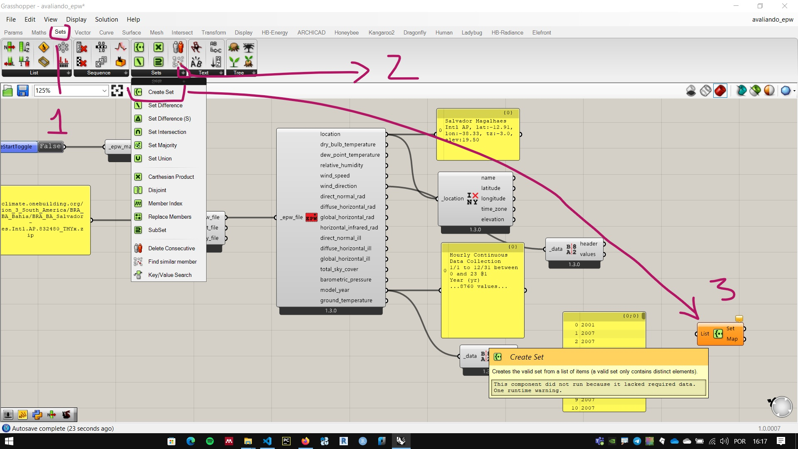

# Avaliando dados do arquivo epw

Em algumas cidades podemos encontrar vários arquivos epw. Cada um contendo informações colhidas por uma estação meteorológica diferente.

Um conjunto de dados adequado é fundamental para qualquer análise e simulação. 

Uma das informações contidas em um arquivo EPW estão nos dados de localização. Estes podem ser acessados pelo componente **LB Deconstruct Location**.

Abaixo da saída **Location** temos os dados climáticos em sequência, com exceção da penúltima saída: **modelYear**, que apresenta os anos em que os dados foram colhidos para criar o modelo de temperaturas padrões durante o ano.

As saídas dos arquivos epw costumam combinar dados textuais e valores. Os demais componentes dos *plugins* Ladybug Tools conseguem separar os dados textuais dos valores automaticamente. Mas para usar os valores em outros componentes do Grashopper é útil usar o componente **LB Deconstruct data**. 

O componente **create set** ajuda na análise de longas listas de informação. A saída **set** apresenta apenas os valores únicos. Neste caso, podemos ver a lista de anos utilizada para modelar os dados.

É possível ordenar as informações da saída através do componete **Sotr List**.

Ordenar e extrair valores únicos são operações recorrentes em análise de dados.

Operações semelhantes podem ser realizadas na saída **windDirection_** para verificar as direções em que o vento foi medido. Algumas estações utilizam apenas os pontos cardeais, outas usam também os colaterais e outras usam mais direções.

### Configuração final

[arquivo final](./avaliando_epw.gh)

