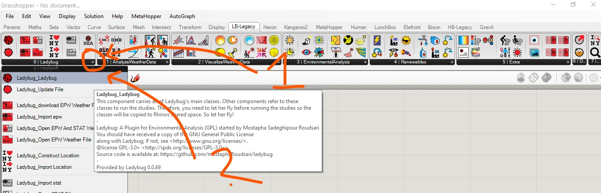
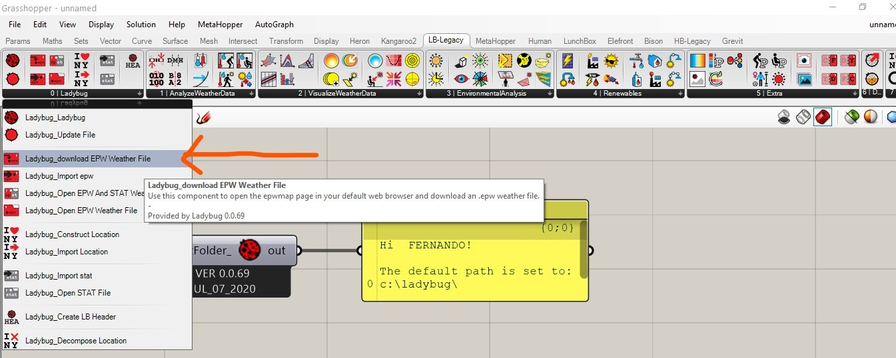
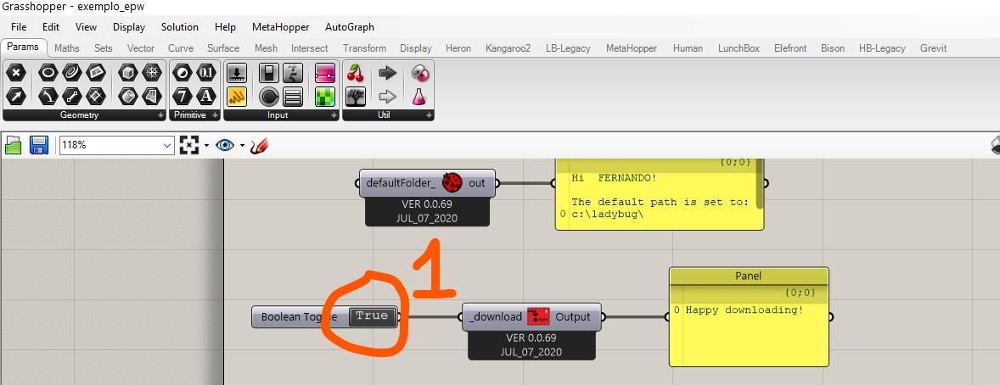
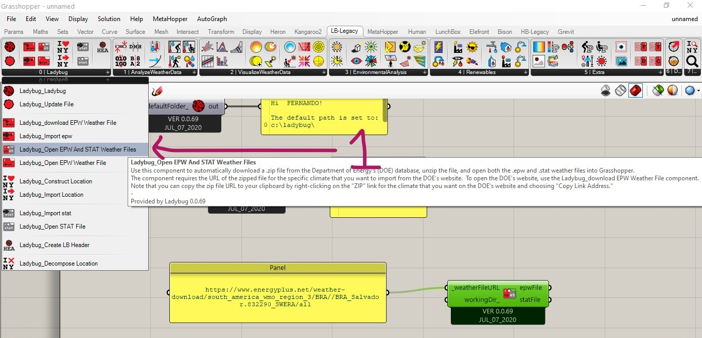
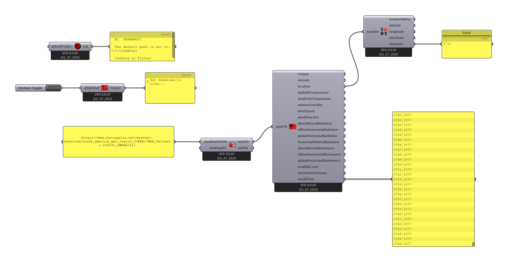

# Arquivos EPW

[Sobre os arquivos do energy plus](https://energyplus.net/weather/simulation)

## Componente Principal do Ladybug

## Baixando Arquivos EPW

### Use o componente de Download

### Use um Boolean Toggle 

### Procure as estações mais próximas da localidade do seu estudo climático.

#### Cleque em cima da estação desejada e escolha a aopção que copia o link

#### IMPORTANTE! Lembre-se de desativar o conector booleano depois de copiar o caminho do arquivo

### Copie o link em um painel do Grasshopper. Use o painel como entrada para o componente Open EPW and STAT Weather File 

### Vamos olhar as caracteristicas de cada arquivo EPW da cidade do projeto.

