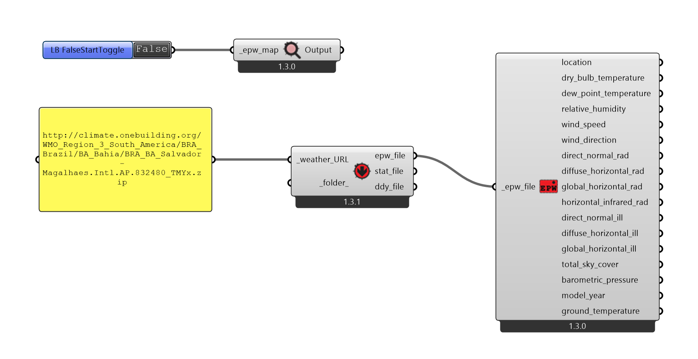

# Arquivos EPW

[Sobre os arquivos do EPW Energy Plus](https://energyplus.net/weather/simulation)

## Baixando Arquivos EPW

Use um componente **LB EPW Map**, localizado na aba **Ladybug**, paleta **0::Import**.

Na entrada do componente **LB EPW Map**, conecte um **Boolean Toogle** ou um componente **LB FalseStar Toogle**, paleta **04::Extra**.

O componente **LB FalseStar Toogle** funciona da mesma maneira que um componente  **Boolean Toogle**, a diferença é que ele é automaticamente ajustado para **False** toda vez que o arquivo é aberto. Esse comportamento é interessante em muitos dos componentes do **Ladybug Tools**.

### Procure as estações mais próximas da localidade do seu estudo climático.

1. Clique em cima da estação desejada e escolha a a opção que copia o link

    #### IMPORTANTE! Caso tenha usado um **Boolean Toggle** padrão do **Grasshopper**, lembre-se de desativar o conector booleano depois de copiar o caminho do arquivo.

1. Copie o link em um painel do Grasshopper. Use o painel como entrada para o componente **LB Download Weather**

1. O **LB Download Weather** torna as informações do arquivo disponíveis para manipulação no Grasshopper. Conecte a saída **epw_file** do **LB Download Weather** na entrda de um componente **LB Import EPW**, aba **Ladybug** paleta **0::Import**.

### Configuração final

[arquivo final](./ladybug_epw.gh)

### Vamos olhar as características de alguns arquivos EPW da cidade escolhida para o projeto.

