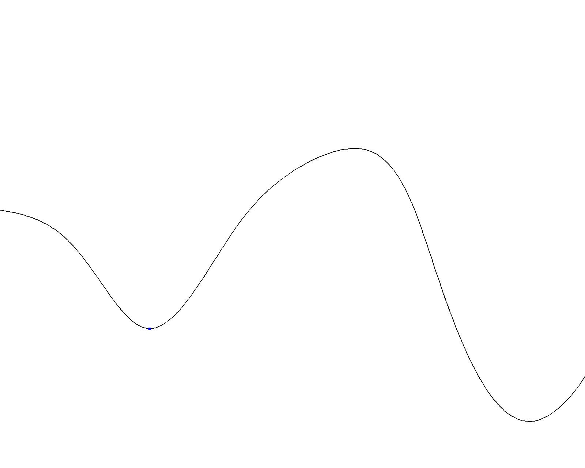
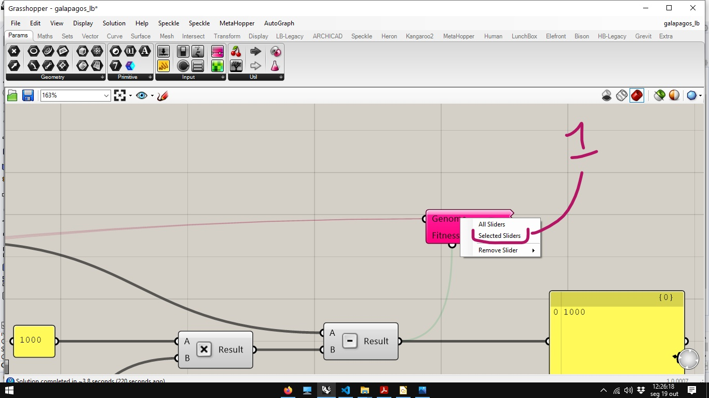
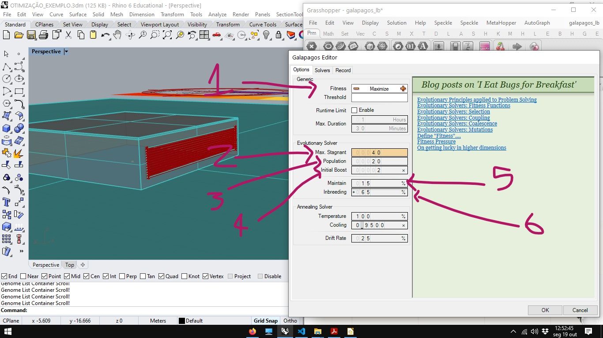
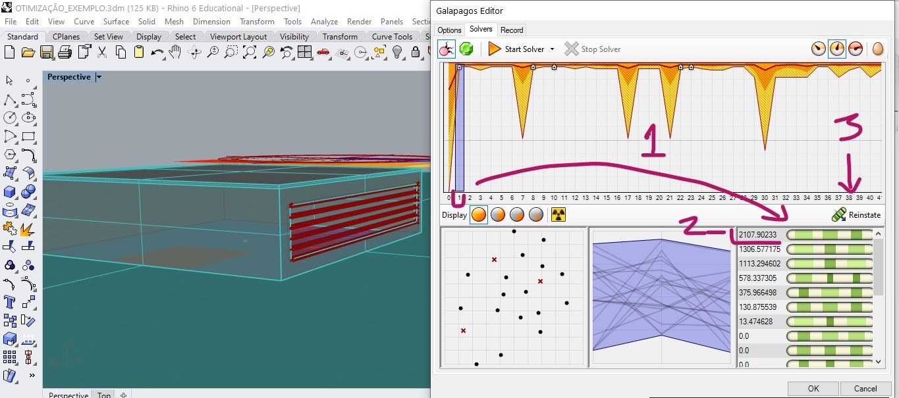
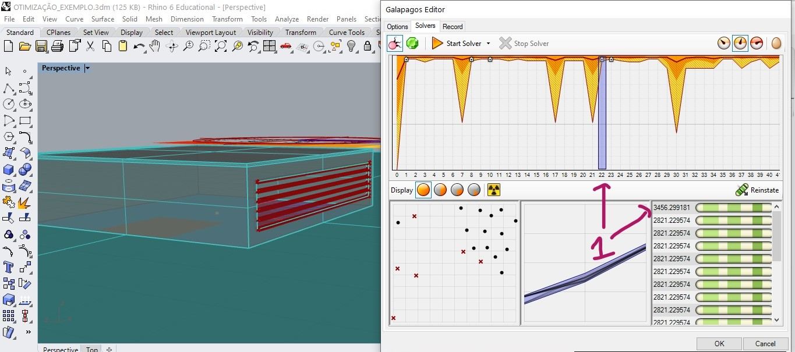
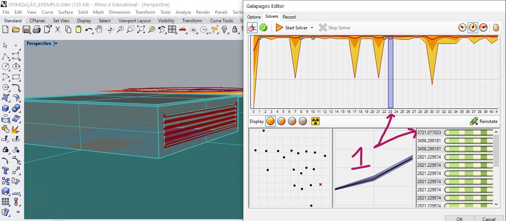

# Otimização Estocástica.

## Método Hill Clibing

### funcionamento do método

### Objetivo almejado

### Limitações do método

_______________________________________

## Mínimos e máximos locais e Globais

###### fonte: https://upload.wikimedia.org/wikipedia/commons/6/68/Extrema_example_original.svg

## Problemas multivariáveis

[fonte](https://en.wikipedia.org/wiki/Test_functions_for_optimization#Test_functions_for_constrained_optimization)

## [Algoritmos Evolucionários](https://en.wikipedia.org/wiki/Evolutionary_algorithm)

### Algoritmos Genéticos

1. #### Função de aptidão (Fitness function)
1. #### Genes
1. #### População (population)
1. #### Geração (generation)
1. #### Reprodução (inbreading)
1. #### Mutação (mutation)

#### Galapagos Solver

[arquivo 3dm](./OTIMIZAÇÃO_EXEMPLO.3dm)

[arquivo gh](./galapagos_lb.gh)

O componente Galapagos fica na aba **Params**, seção **uitl**. 

A maneira mais prática de indicar os parâmetros de otimização para o algoritmo é:
primeiro selecione todos os **sliders** que pretende otimizar.

Em seguida, clique com o botão direito na entrada **genome** do componente **Galapagos** e escolha a opção **Selected Sliders**

Para indicar o valor a ser usado como função de aptidão, é preciso arrastar a conexão da entrada do componente Galápagos para a saída que apresenta o valor a ser otimizado.

#### Rodando a simulação.

  

[registro da otimização](./RECORD.TXT)

