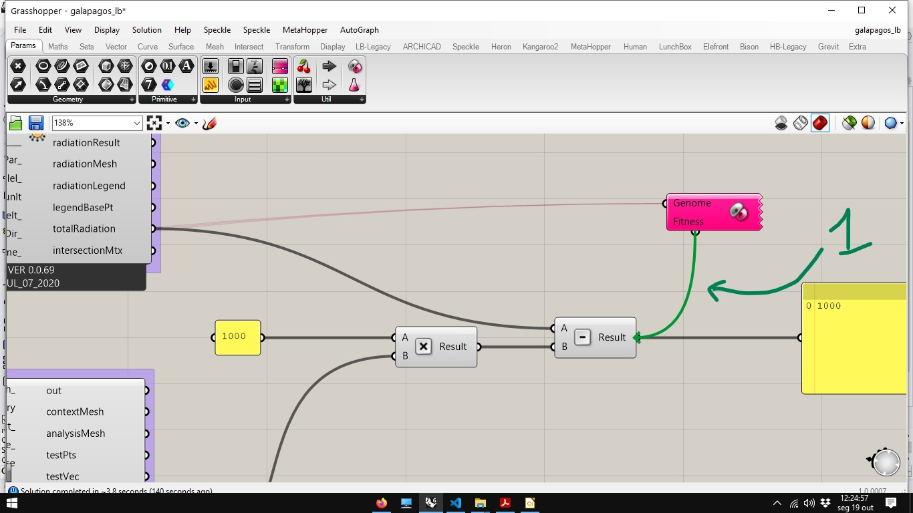
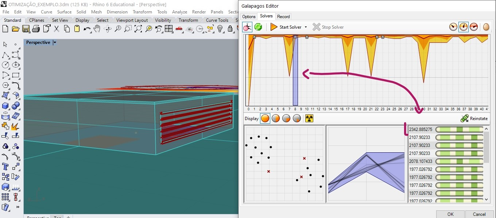
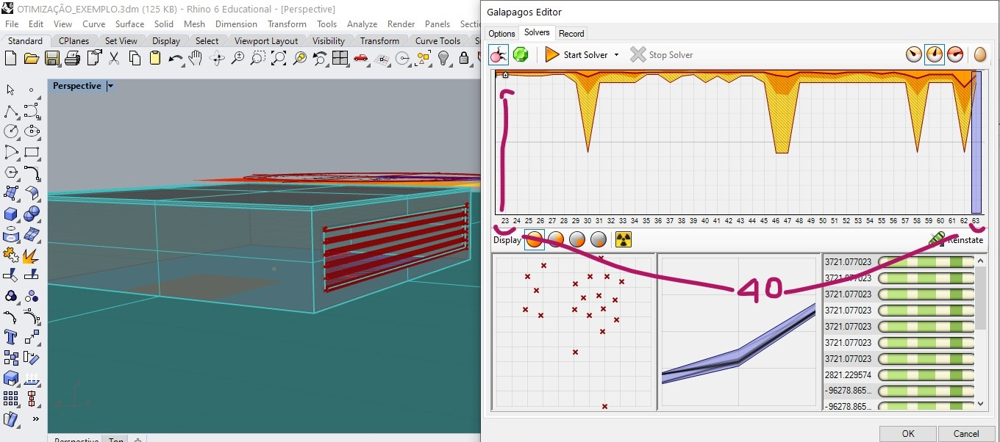

# Otimização Estocástica.
________________________________________________

## Entendendo o problema

[exemplo teórico 3dm](./galapagos_exemplo_teorico.3dm)

[exemplo teórico gh](./galapagos_exemplo_teorico.gh)

_________________________________________
### Método HILL CLIMBING

#### Funcionamento do método

#### Objetivo almejado

#### Limitações do método

_______________________________________

### Mínimos e máximos locais e Globais

###### fonte: https://upload.wikimedia.org/wikipedia/commons/6/68/Extrema_example_original.svg

### Problemas multivariáveis

[fonte](https://en.wikipedia.org/wiki/Test_functions_for_optimization#Test_functions_for_constrained_optimization)

_________________________________________________________

## [Algoritmos Evolucionários](https://en.wikipedia.org/wiki/Evolutionary_algorithm)

### Algoritmos Genéticos

1. #### Função de aptidão (Fitness function)
1. #### Genes
1. #### População (population)
1. #### Geração (generation)
1. #### Reprodução (inbreading)
1. #### Mutação (mutation)

#### Galapagos Solver

[arquivo 3dm](./OTIMIZA_EXEMPLO.3dm)

[arquivo gh](./galapagosLadyBug.gh)

O componente Galapagos fica na aba **Params**, seção **uitl**. 

A maneira mais prática de indicar os parâmetros de otimização para o algoritmo é:
primeiro selecione todos os **sliders** que pretende otimizar.

Em seguida, clique com o botão direito na entrada **genome** do componente **Galapagos** e escolha a opção **Selected Sliders**

Para indicar o valor a ser usado como função de aptidão, é preciso arrastar a conexão da entrada do componente Galápagos para a saída que apresenta o valor a ser otimizado.

Clique duas vezes no ícone do componente **Galapagos** para abrir o editor do *solver*.

#### Rodando a simulação.

O *Galapagos Editor* possui 3 abas: Options (para configurar a análise), Solver (para rodar a simulação) e Record (onde é gravado um registro do passo a passo de uma simulação).

Em options podemos configurar:
 1. se o algoritmo vai procurar por um máximo ou mínimo local.
 2. quantas gerações podem ser geradas sem evolução na função de aptidão.
 3. O tamanho da população
 4. quantas vezes a população inicial será aumentada na primeira geração
 5. O percentual de indivíduos a serem mantidos conforme critério da função de aptidão.
 6. Percentual de indivíduos a serem gerados a partir da combinação dos genes de indivíduos mantidos na geração anterior.

1. Utilizar o solver genético
2. iniciar a otimização
3. diagrama das gerações
4. representação da população
5. representação do genoma
6. representação dos indivíduos de uma geração

É possível selecionar uma gerção (1) e um indivíduo (2) de uma geração e ajustar os slidres para a posiçãod este individuo (3).

O pequeno sinal de + no diagrama das gerações indica que um novo valor para máximo global foi encontrado.

Podemos ver o valor de máximo encontrado na geração 8 na imágem abaixo

Na geração 10, outro valor de máximo foi encontrado.

Na geração 22 um novo candidato a máximo global foi encontrado.

na geração 23 um novo valor é encontrado.

Após 40 gerações sem alternar o valor maior que o encontrado na geração 23, o solver atinge sua condição de parada.

  

Abaixo temos um arquivo com a cópia dos valores gravados durante a otimização.

[registro da otimização](./RECORD.TXT)