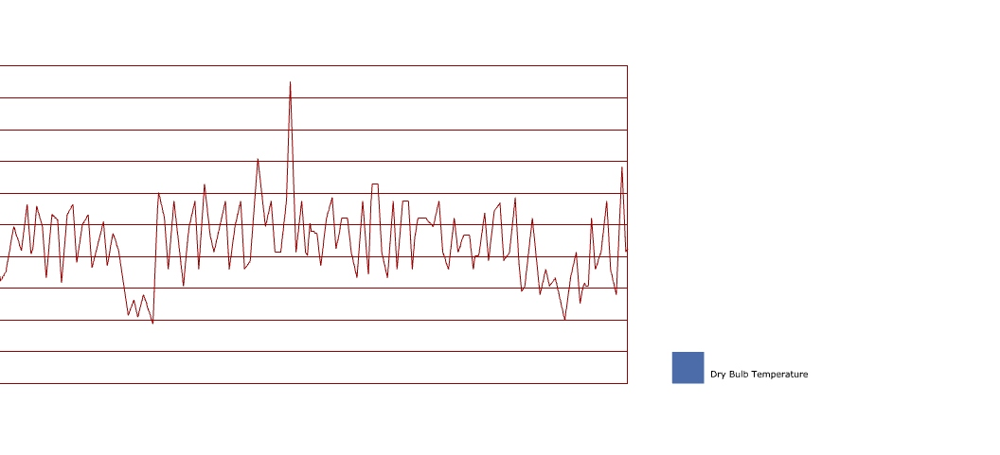
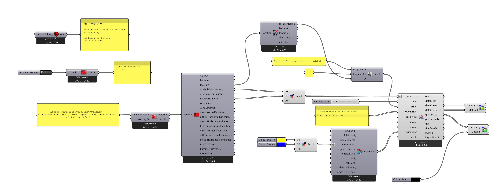

# Gráfico de Linhas

Partindo do [arquivo final](../epw_arq/ladybug_epw.gh) do guia [Baixando Arquivos EPW e importando dados](../epw_arq/ladybug_epw.md)

Na seção **2\| Visualize Wheather Data**, selecione o componente **ladybug_line Chart**

Conecte a saída de temperatura (dryBulbTemperature) do componente ladybug_Import epw** na entrada **_InputData** do componente **Ladybug_Line Chart**.

O resultado na interface do Grasshopper é um gráfico de temperaturas medidas hora à hora em todos os dias do ano. Do lado esquerdo vemos a escala de valores da temperatura e do lado direito uma legende de cores (no caso apénas uma cor) que não corresponde à cor da linha (desenhada na cor padrão de geometria do Grasshopper). 

Para ver as linhas nas cores certas, utilize o componente **Custom Preview** conforme figura abaixo:

É possível colocar múltiplos dados na entrada do gráfico. Pode-se, por exemplo, conectar a saída de umidade na mesma entrada **_InputData** segurando a tecla **shift** para manter as duas entradas ao mesmo tempo.

Ou, de maneira mais clara, usar um componente **Merge** para agregar as informações.

Por ambos os caminhos, teremos gráficos semelhantes, com a escala do primeiro conjunto de dados do lado esquerdo e do segundo conjunto de dados do lado direito, junto com a escala gráfica.

Com mais de dois conjuntos de dados, já não é possível visualizar as escalas de todos os dados. Adicionando a velocidade do vento às entradas do componente, temos:

Considerando apenas duas entradas, algumas personalizações foram feitas no gráfico utilizando:

O componente **Ladybug_Deconstruct Location** que separa as informações da saída Location do arquivo epw.

Um componente **Concatenate** que junta informações de texto.

Um componente **ladybug_Legend Parameters** que permite alterações nas propriedades as legendas de um gráfico.

Alguns painéis e alguns componentes **Color Swatch**

Clicando duas vezes na parte de um componente **Color Swatch** que exibe uma cor:

É possível selecionar uma nova cor, ajustando os controles e clicando na opção accept

[Arquivo final](./gra_temp_um_line.gh)

