# Mapa de Calor

Partindo do [arquivo final](../epw_arq/ladybug_epw.gh) do guia [Baixando Arquivos EPW e importando dados](../epw_arq/ladybug_epw.md)

Utilizando um componente **LadyBug_3D Chart** é possível gerar um mapa de calor que relaciona uma variável qualquer em função do tempo.

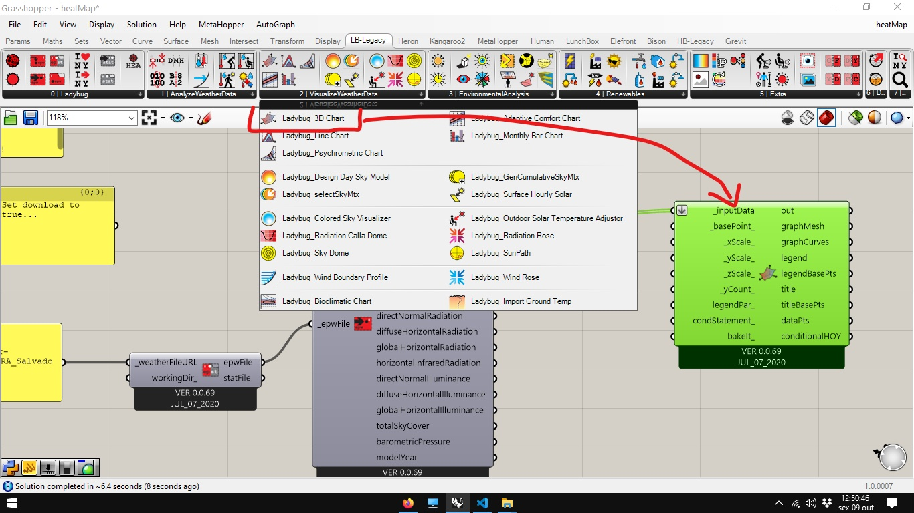


Neste exemplo foram utilizadas as informações da saída **dryBulbTemperature** do EPW, mas o mapa de calor é um tipo de gráfico que relaciona valores com escala de cores.

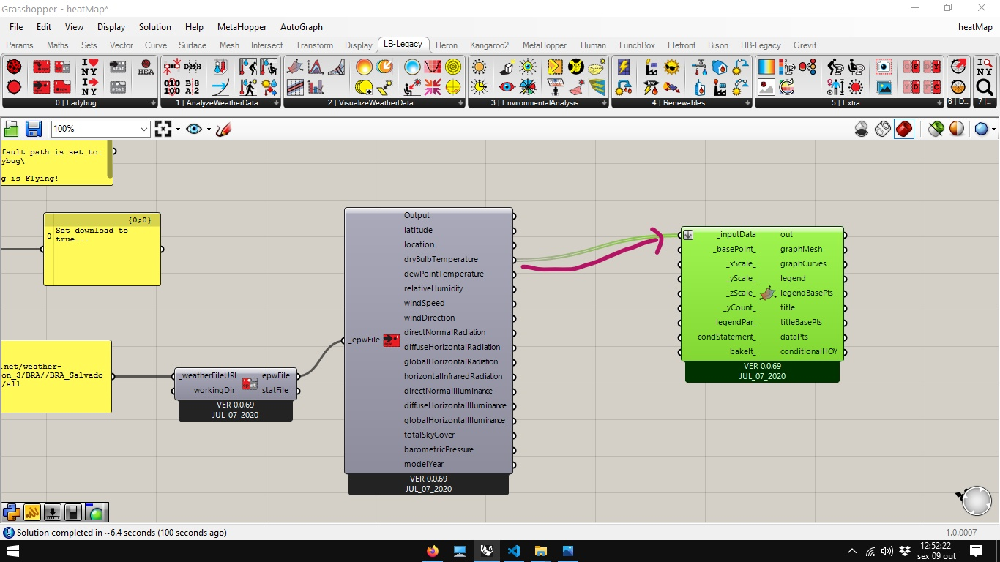

O **LadyBug_3D Chart** apresenta as horas no eixo Y e os dias do ano no eixo x, usando a escala de cores para representar o valor do dado grafado.

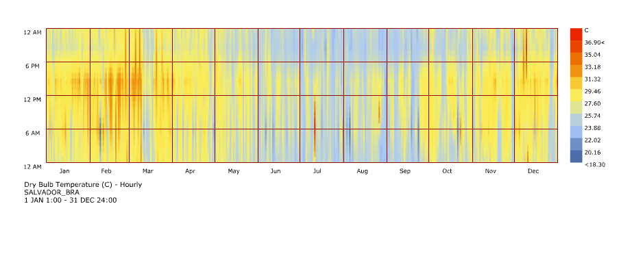

Caso mais de um conjunto de dados seja colocado na entrada **_inputData**...

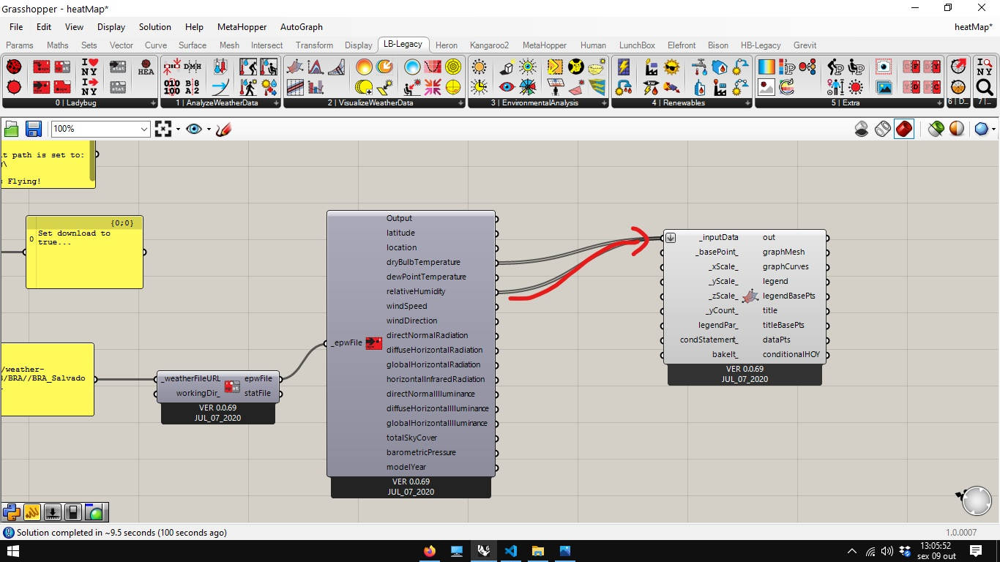

... O componente retornara dois gráficos separados.

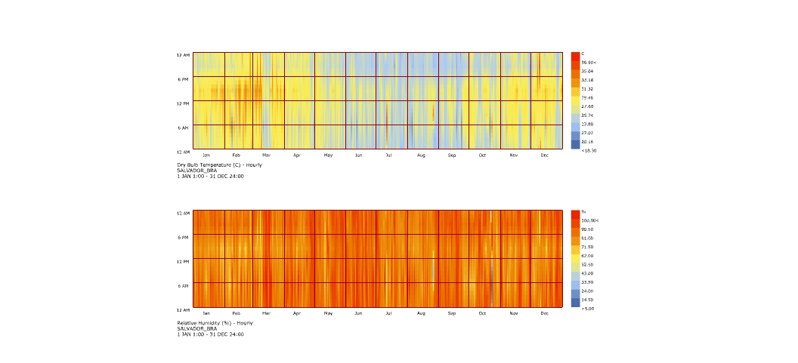

Escalas gráficas são formas eficientes de se visualizar dados, mas, sem o devido cuidado, podem levar aa erros de interpretação.

Abaixo vemos os gráficos de temperatura de bulbo seco para duas cidades distintas:

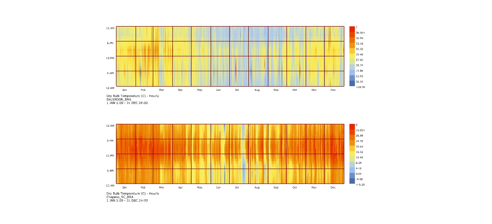

Os gráficos foram gerados a partir do arquivo gh abaixo:


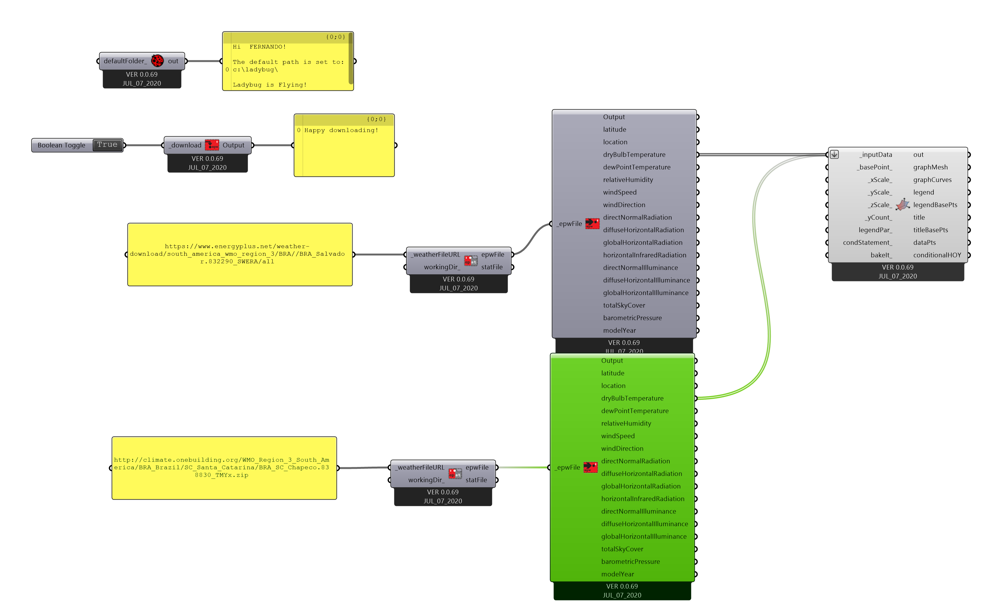

Os Arquivos epw foram baixados dos respectivos links:

```
https://www.energyplus.net/weather-download/south_america_wmo_region_3/BRA//BRA_Salvador.832290_SWERA/all
```

e 

```
http://climate.onebuilding.org/WMO_Region_3_South_America/BRA_Brazil/SC_Santa_Catarina/BRA_SC_Chapeco.838830_TMYx.zip
```


Embora aparentemente mais quente, A cidade de baixo, Chapecó, SC, é muito mais fria que a cidade de cima, Salvador, BA. Quando olhamos de perto as legendas de temperatura dos dois gráficos, vemos que embora usem as mesmas cores para representar temperaturas, Na legenda de salvador, vemos que os valores estão variando entre 18.30 e 36.90 °C, já para Chapecó, entre -8.20 e 33.00 °C.

Essa diferença de escalas gráficas pode levar a conclusões apressadas e erradas. Para poder analisar os dados em conjunto é preciso aplicar escalas gráficas iguais para as duas cidades.

Conectando um componente **Ladybug_Legend Parameters**, conforme figura abaixo, vemos que é possível ajustar os valores de máximo e mínimo para o gráfico. 

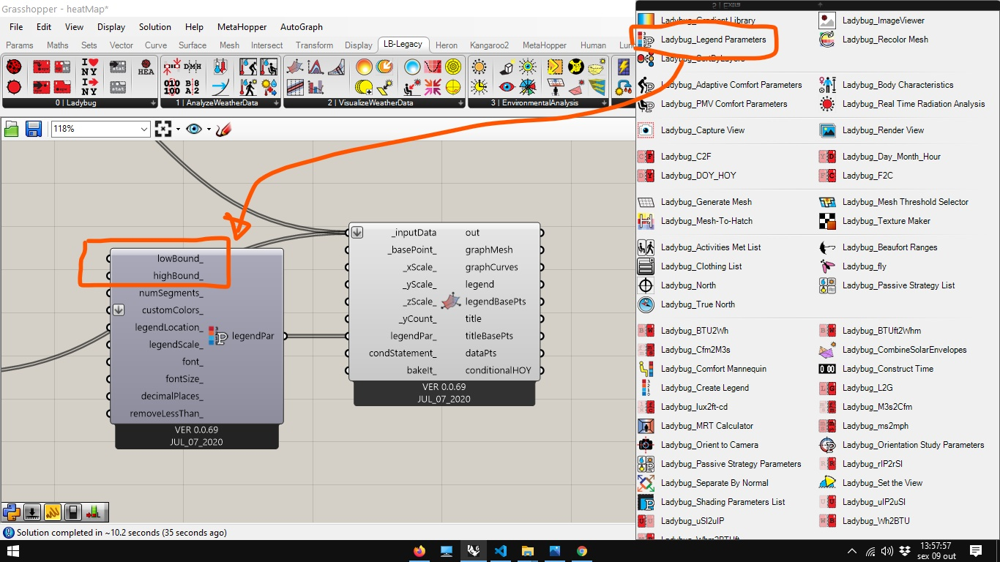

É possível ajustar estes limites com **Sliders**, utilizando os valores de -8.20 e 36.90 °C como mínimo e máximo respectivamente. Mas, utilizando uma abordagem paramétrica, podemos tratar os dados de temperatura e automatizar a escolha de máximos e mínimos para quaisquer duas cidades que ossuam arquivos EPW.

O primeiro passo é separar os dados de temperatura das informações adicionais da saída do EPW. Utilizando o componente **Ladybug_Separete Data** conforme indicado abaixo.

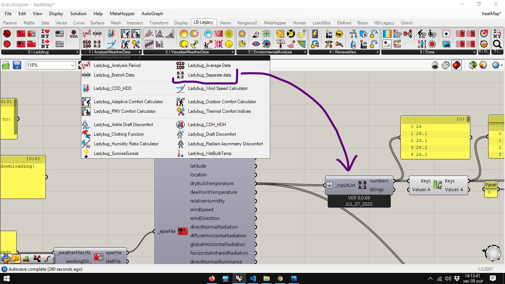

Os valores da saída numérica estão organizados pela ordem de medição. O componente **Sort List** ordena os dados em ordem crescente. 

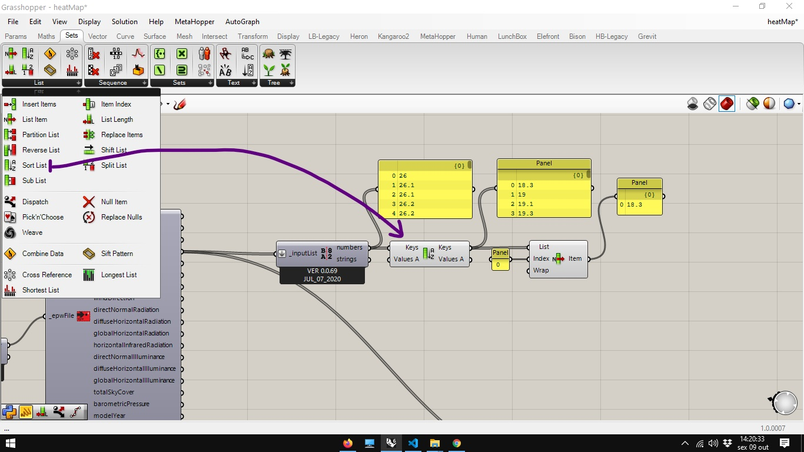

O componente **List Item** consegue selecionar um elemento de uma lista, de acordo com o seu índice. Colocando o valor 0 (zero) como índice, conseguimos extrair o primeirovalor da lista ordenada.

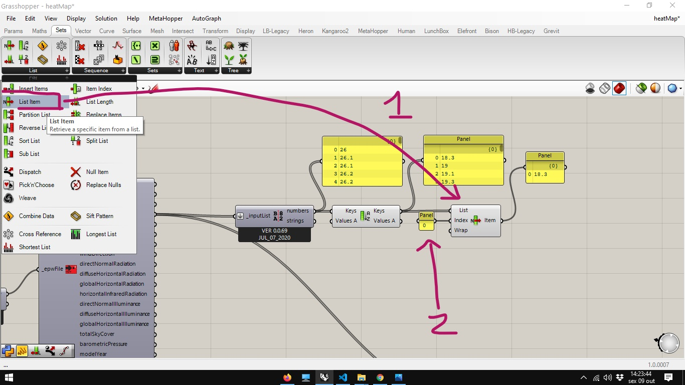

Para obter o valor máximo, utilizamos um componente **Reverse List**, que inverte a ordem dos valores ordenados. Passando de ordem crescente prar ordem decrescente, o primeiro elemento da lista na saída do componente **Reverse List** é o maior valor medido, e pode ser extraído com as mesma estratégia ( componente **List Item** e valor 0 para i índice).

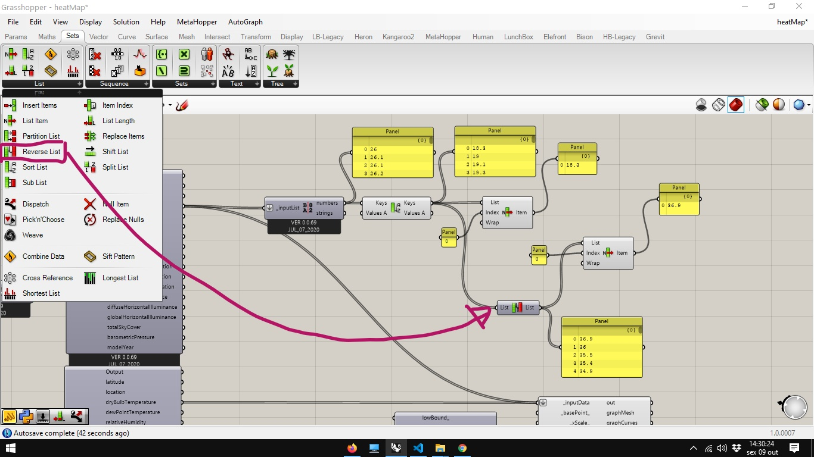


Copie o Componente **Ladybug_Separete Data**, conecte os dados de temperatura da segunda cidade nele, conecte a segunda saída dos dois componentes em um componente **Merge** e conecte a saída do componente merge com a entrada do componente **Sort List**.

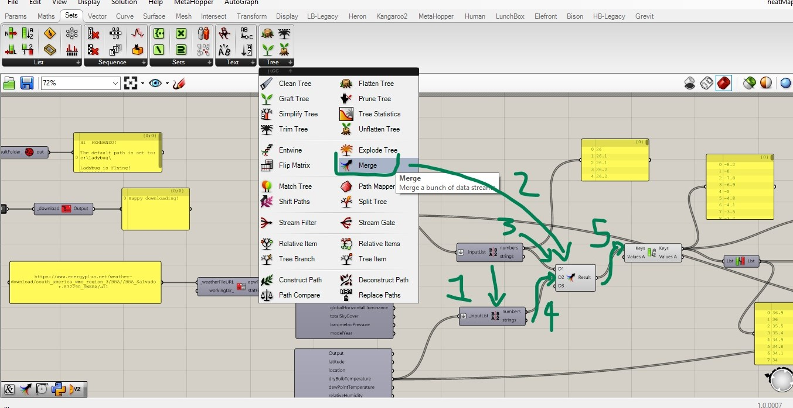

Para finalizar, conecte o valor menor na entrada **lowBound_** e o valor maior na entrada **highBound_**

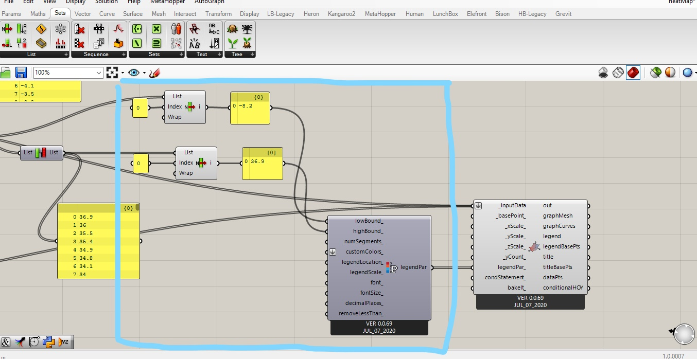

[Arquivo final](./heatMap.gh)

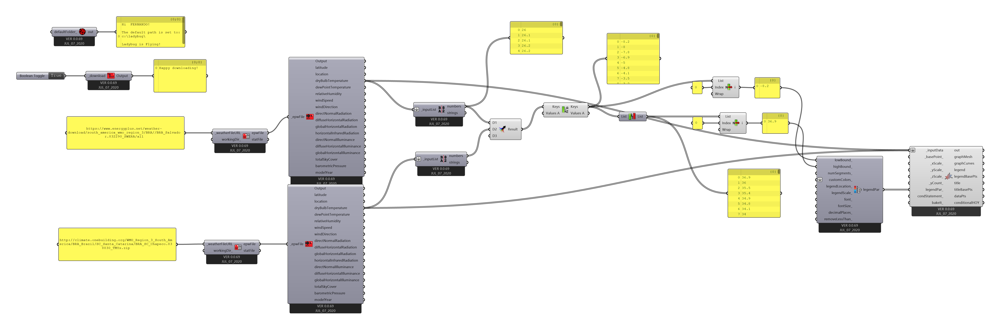

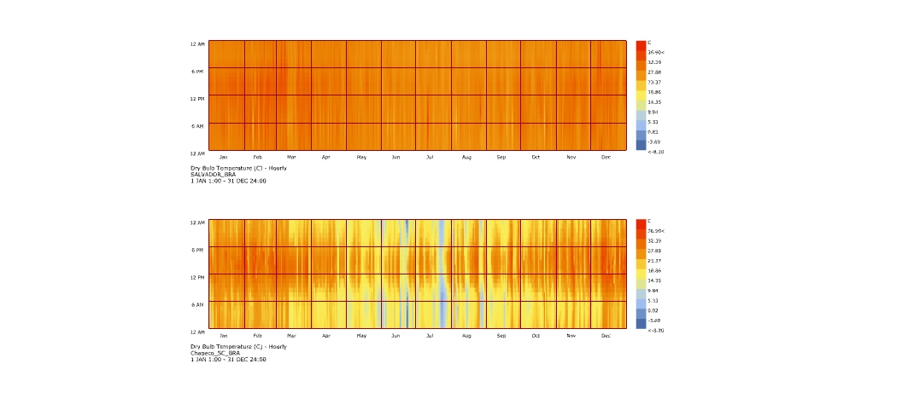

