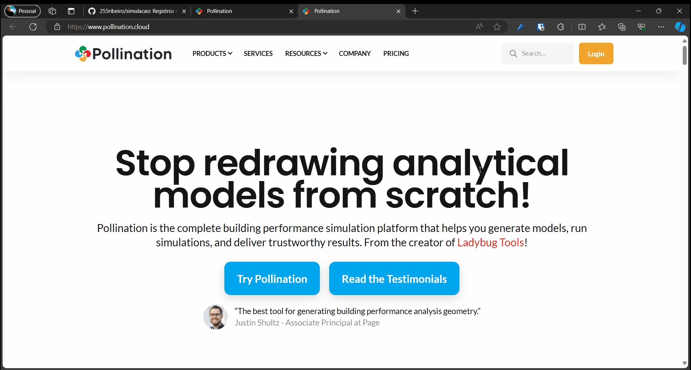
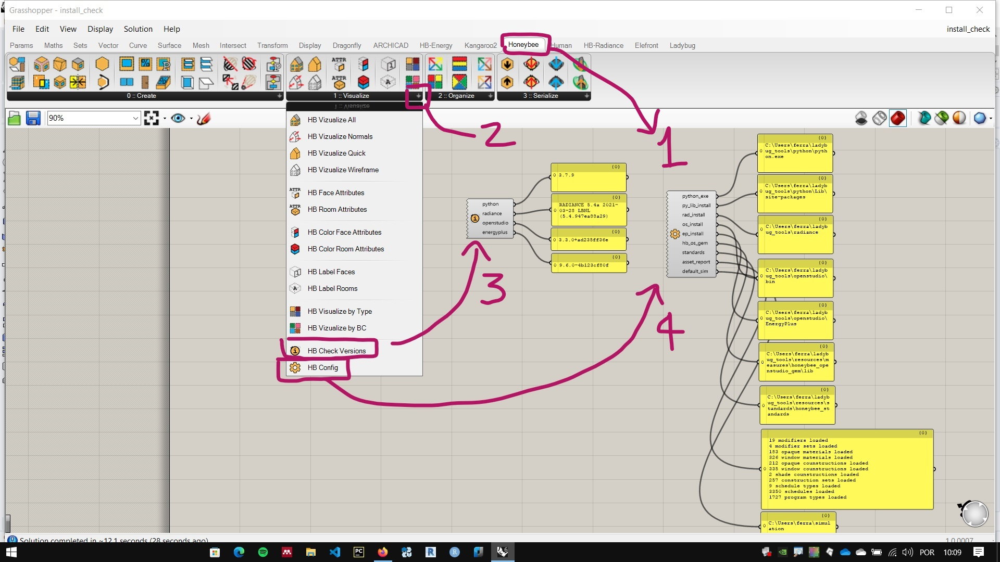

# Guia de instalação dos programas

## Instalação do **Rhinoceros**

1. Instalar o **Rhinoceros** ( versão 6, 7 ou 8)
   - link: [https://www.rhino3d.com/download/](https://www.rhino3d.com/download/)

1. Caso o **Rhinoceros** seja instalado em português, mudar o idioma para inglês.
   - Instruções: [https://wiki.mcneel.com/rhino/6/addlanguages](https://wiki.mcneel.com/rhino/6/addlanguages)


## Instalação do Ladybug Tools

Uma vez que o Rhinoceros esteja instalado, existem **dois métodos** de instalação do LadyBugTools.

1. A mais fácil é pelo instalador do plug-in Pollination para Grasshopper. Este instala todas as dependências necessárias.

2. A outra é usando o instalador do LadyBugTools, para essa instalação funcionar, é necessário instalar todas as dependências conforme instruções na documentação.

### Método 1: Instalação o plug-in Pollination:

1. Clique no Link [https://www.pollination.cloud/](https://www.pollination.cloud/) - é preciso fazer uma conta no site do pollination para baixar.
2. Baixar o plugin do Pollination para Grasshopper - link [https://www.pollination.cloud/grasshopper-plugin](https://www.pollination.cloud/grasshopper-plugin)



3. Rode o instalador e siga as instruções


### Método 2: Instalando o LadyBugTools e todas as dependências:

1. Baixar o **Ladybugtools**.
   - Link : [https://www.food4rhino.com/en/app/ladybug-tools#downloads_list](https://www.food4rhino.com/en/app/ladybug-tools#downloads_list) - é preciso fazer uma conta no site para baixar.
  
1. Seguir as instruções de instalação.
   - link: [https://github.com/ladybug-tools/lbt-grasshopper/wiki](https://github.com/ladybug-tools/lbt-grasshopper/wiki)

2. Executar os passos opcionais de instalação do **Radiance**, do **Openstudio** e do **URBANopt**:
   - [https://github.com/ladybug-tools/lbt-grasshopper/wiki/1.1-Windows-Installation-Steps#optional-steps](https://github.com/ladybug-tools/lbt-grasshopper/wiki/1.1-Windows-Installation-Steps#optional-steps)
   - ou: baixe instaladores do **Radiance**, do **Openstudio** e do **URBANopt** relativos à versão do **Ladybug Tools** que você instalou, segundo as informações contidas na [matriz de compatibilidade](https://github.com/ladybug-tools/lbt-grasshopper/wiki/1.4-Compatibility-Matrix) para a sua versão do Ladybug Tools.

   - Preferencialmente, instale os programas nas pastas : <br>
  
      ``` %userprofile%\ladybug_tools\radiance ``` e
      ``` %userprofile%\ladybug_tools\openstudio ``` 
  
  (recomendado pela documentação de instalação, embora a mesma fonte diga que os programas funcionam no caminho padrão sugerido pelo instalador)

## Testando a instalação:

Para testar a instalação, na aba **HoneyBee** na paleta **1::Visualize**, utilize os componentes **HB Check Version** e **HB Config** e coloque painéis para ver a saída dos componentes. Alternativamente, pode-se usar o arquivo de teste na instalação disponível no link abaixo:

- [Arquivo Teste](./install_check.gh)



Compare os valores de saída do componente **HB Check Version** com as versões apresentadas na matriz de compatibilidade para a sua versão do Ladybug Tools

#### Pastas importantes da instalação do LadybugTools:

- Pasta da instalação do Ladybug tools:
      
   ``` %userprofile%\ladybug_tools ```
- Pasta da instalação dos **Plugins** do **Grasshopper**:
      
   ``` %APPDATA%\Grasshopper ```
- Pasta de download dos dados climáticos:
      
   ``` C:\ladybug ```
