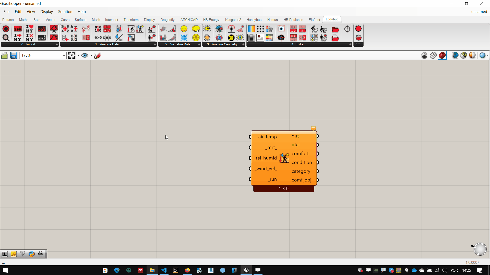
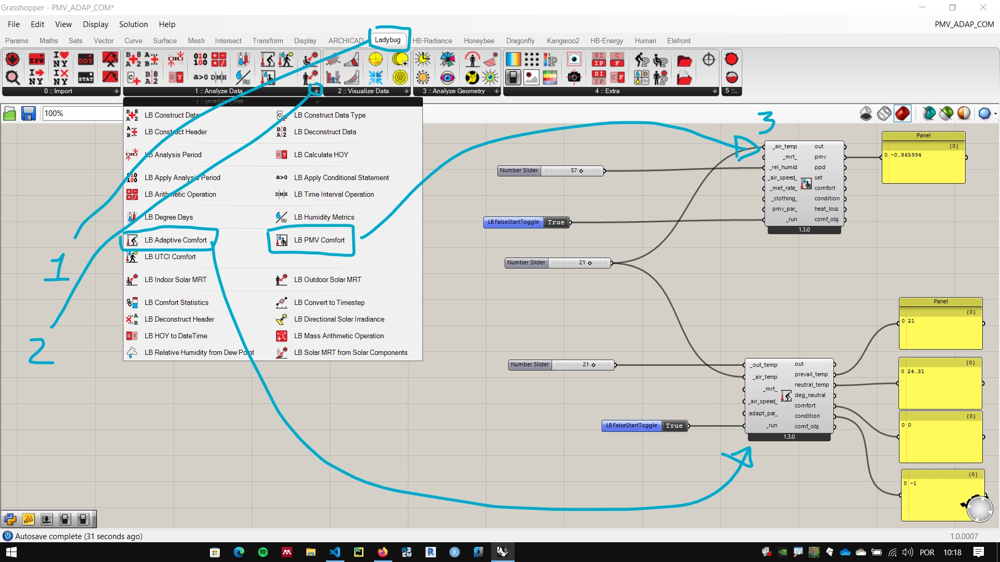
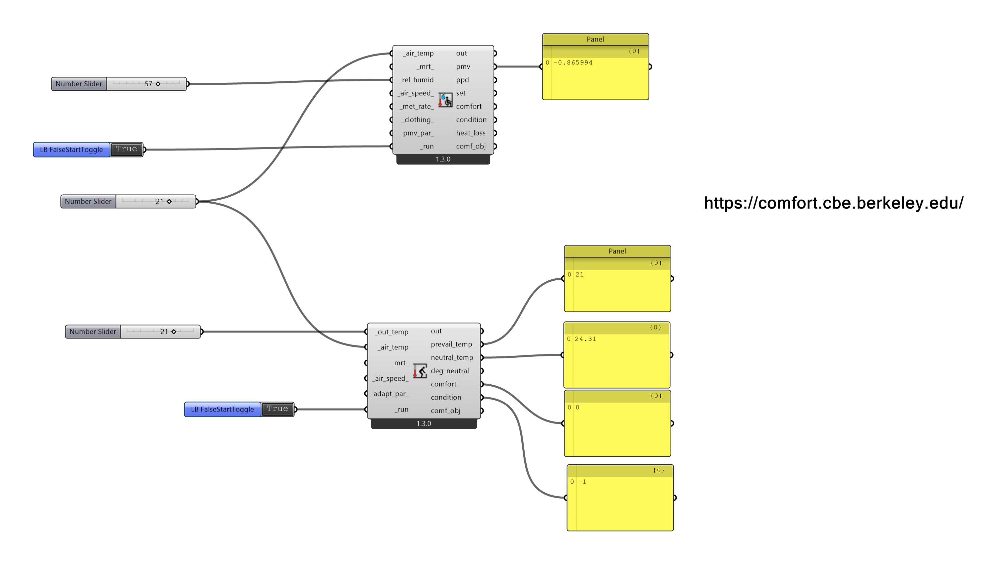

# Interface Básica

## Universal Thermal Climate Index 

1. Análise de conforto térmico (exterior)
     Para ilustrar o funcionamento do plug-in, vamos utilizar o componente **Ladybug UTCI  Calculator**
     

1. Entradas
       Por padrão do Grasshopper as entradas ficam no lado esquerdo e as saídas no lado direito dos componentes. As entradas podem ser obrigatórias ou opcionais.

1. Entradas Obrigatórias
     Por convenção, todas as entradas obrigatórias dos componentes do LadyBug tem seus nomes iniciando por um caractere "_" (**underscore**). Para este componente as obrigatórias são:

    1. Temperatura de bulbo seco [*_air_temp*](https://en.wikipedia.org/wiki/Dry-bulb_temperature)
    2. Umidade relativa do ar [*_rel_humid*](https://en.wikipedia.org/wiki/Relative_humidity)
    3. ***_run***

     Conectando um valor numérico nas entradas de *_air_temp* e *_rel_humid*, o componente tem informações suficientes para calcular o UTCM, mas é preciso colocar um valor Booleando **True** na entrada *_run*. 

     

1. As entradas com (**underscore**) no início e no fim do nome, são opcionais, tendo valores padrões que são usados quando nenhuma informação é inserida.
   1. Temperatura radiante média [*_mrt_*](https://en.wikipedia.org/wiki/Mean_radiant_temperature)
   2. *_wind_vel_*

[arquivo exemplo](./utci.gh)

## Predicted mean vote (PMV) e adaptive comfort

[Calculadora online](https://comfort.cbe.berkeley.edu/) de conforto termico do **Center for the Built Environment (CBE)** da Universidade de Berkley.

### PMV

Artigo no[designing buildings](https://www.designingbuildings.co.uk/wiki/Predicted_mean_vote) sobre PMV

Artigo sobre [PMV e PDD](https://www.simscale.com/blog/2019/09/what-is-pmv-ppd/)

### Adaptive comfort

[Adaptive Comfort](https://cbe.berkeley.edu/research/adaptive-comfort-model/) no **Center for the Built Environment (CBE)** da Universidade de Berkley.

Artigo sobre [Adaptive Comfort](http://petersimmonds.com/thermal-comfort/).

### Componentes do Ladybug

[Arquivo Grasshopper](./PMV_ADAP_COM.gh)

___________
___________
