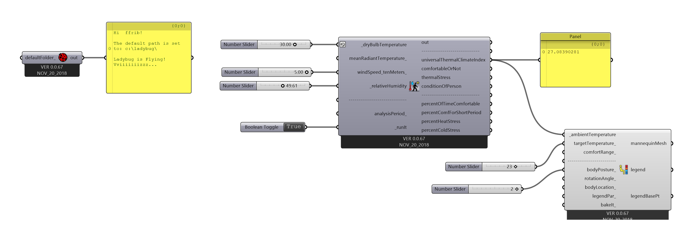

# Interface básica do Ladybug tools

 1. Componente LadyBug_LadyBug
      
     Todos os algoritmo que usam componentes do LadyBug Começam com o componete Ladybug_ladybug. Ele contem um código de programação que é utilizado por todos os outros componentes do Plug-in.

     

      
     Se conectarmos um painel na saída do componente, aparecerá uma menságem mostranto que o componente está funcionando e que os demais componentes do plug-in podem ser utilizados.
        

1. Análise de conforto térmico (exterior)
     Para ilustrar o funcionamento do plug-in, vamos utilizar o componente **Ladybug_Outdoor Confort Calculator**
     

1. Entradas
       Por padrão do Grasshopper as entradas ficam no lado esquerdo e as saídas no lado direito dos componentes. As entradas podem ser obrigatórias ou opcionais.

2. Entradas Obrigatórias
     Por convenção, todas as entradas obrigatórias dos componentes do LadyBug tem seus nomes iniciando por um caractere "_" (underscore). Para este componente as obrigatórias são:

    1. Temperatura de bulbo seco [(**_dryBulbTemperature**)](https://en.wikipedia.org/wiki/Dry-bulb_temperature)
    2. Umidade relativa do ar [(**_relativeHumidity**)](https://en.wikipedia.org/wiki/Relative_humidity)
    3. ***_run_it***
   
3. Entradas Opcionais
     Embora não estejam entre os requisitos mínimos para o funcionamento de um componente, as entradas opcionais passam informações que são usadas nos cálculos. Muidas vezes são utilizados valores padrões quando as entradas opcionais não são utilizadas.
    
     Por convenção, nos componentes do LadyBug tool, as entradas opcionais são marcadas com um caractere "_" no final do nome.

     1. meanRadiantTemperature_
     2. windSpeed_tenMeters_
     3. analisysPeriod_

     Parando o ponteiro do mouse sobre uma das entradas ou saidas, vemos uma descrição das suas caracteristicas.

4. Saídas
   1. out - Saída comum aos componentes da linguagem Python no Grasshopper. Se conectar um painel a uma destas saídas, as mensagens internas geradas pelo *script* podem ser lidas.
   2. Sensação Térmica ([Universal Thermal Climate Index]()) - Um dos índices de cálculo da sensação térmica. 
   3. **confortableOrNot**
   4. **thermalStress**
   5. **conditionOfPerson**
   6. **percentOfTimeConfortable**
   7. **percentConfortForShortPeriod**
   8. **percentHeatStress**
   9. **percentColdStress**

1. Atribuindo valores ás entradas obrigatórias.

     Para usar o componetente para obter os valores de sensação térmica para uma determinada combinação das entradas obrigatórias, podemos conectar slides para a temperatura e a umidade e um painel na saída correspondente ao **Universal Thermal Climate Index**.

    

     O componente **_run_it** recebe um valor booleano verdadeiro ou falso (True or False). A deiai deste componete é poder ligar ou desligar componentes do ladyBug que executem cálculos complexos até que todas as entradas estejam devidamente ajustadas.

    

    Com um componente **Boolean Toggle** conectado e ajustado para **True** o resultado pode ser visto no painel de saída.

1. Gráfico do manequim
     
     Um componente interessante para representar o conforto térmico de um indivíduo é o Ladybug_Comfort Mannequin. Ele pode ser encontraado na aba **5| Extra** do Ladybug.

     
     
     

    