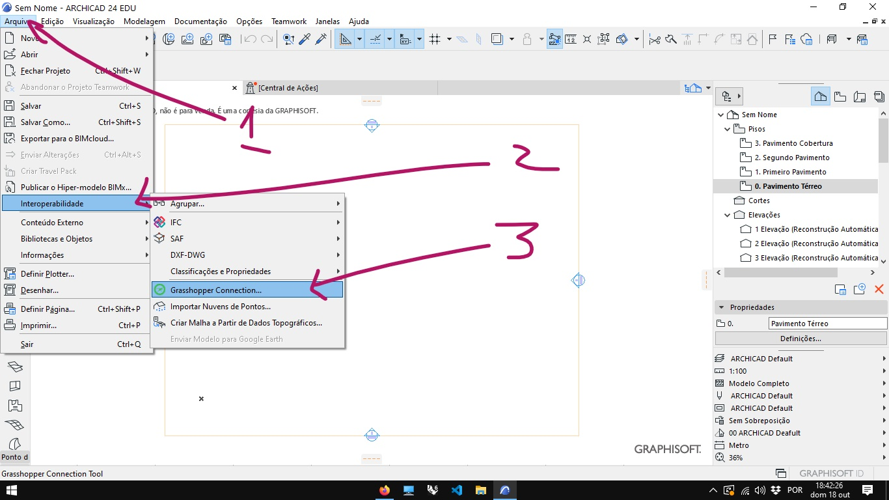
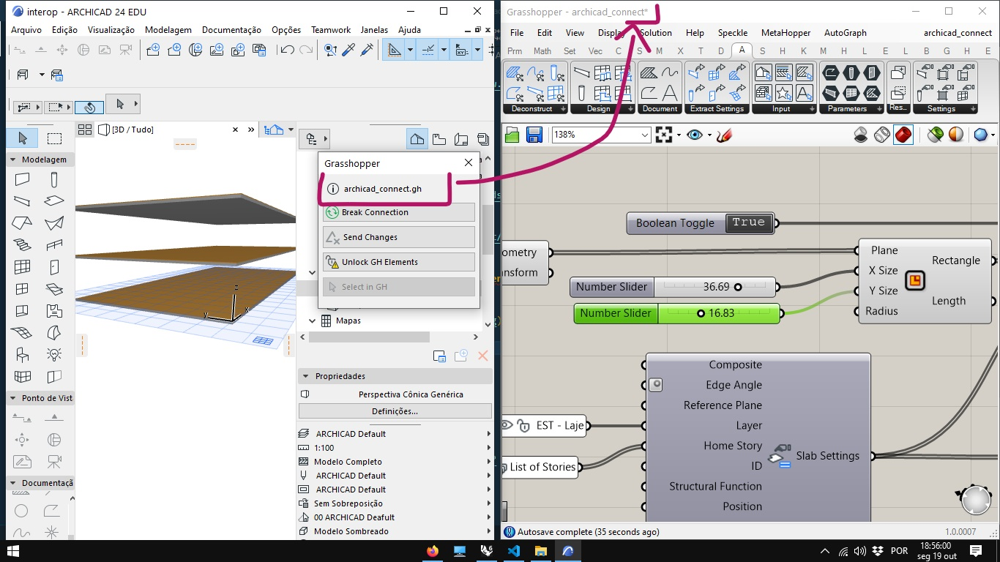

# Interoperabilidade Entre Sistemas Paramétricos/BIM

## Revit

### Sitema paramétrico nativo:

 [Dynamo](https://dynamobim.org/)

 

### Interoperabilidade Rhino-Grasshopper/Revit

#### Grevit

[Grevit](https://grevit-dev.github.io/Grevit/)

[teste_grevit.gh](./teste_grevit.gh)

[teste_grevit.3dm](./teste_grevit.gh)

[Tutoriais Grevit](https://www.youtube.com/watch?v=3okGO-irCys&list=PLaui6TX01w8PzW0eMjfqjMPpNIDVVFSBu&index=1)

#### HummingBird

[hummingbird](https://www.food4rhino.com/app/hummingbird)

[tutorial HummingBird]()

#### Rino Inside Revit

[teste rhino inside Revit](./rhino_inside.gh)

[Tutoriais Rhino Inside Revit](https://www.youtube.com/watch?v=x_MU3vO1_II&list=PLWIvZT_UEpWUB0Bc9RvVySTIGX6WpYMXk)

## ArchiCAD

### Sistema paramétrico nativo:
 
 [Param-O](https://graphisoft.com/downloads/param-o)

 

### Interoperabilidade Archicad-Grasshopper Connect

[Arquivo Archicad](./interop.pln)

[Arquivo gh](./archicad_connect.gh)

[Arquivo 3dm](./archicad_connect.3dm)

[Tutoriais](https://www.youtube.com/watch?v=xKaMT1LjM7o&list=PLnXY6vLUwlWWlRTtx9q983Xch8j36J42U)

## VisualArq

[Site](https://www.visualarq.com/)

[tutoriais VisualArq-Grasshopper](https://www.youtube.com/watch?v=4n8U-PGmhCk&list=PLLfTyZ7LBWcyk2htKb8RQPLHvE0llLGSZ)

## IFC

#### GeometryGym

[Site](https://geometrygym.wordpress.com/purchase/#support)

[Download](https://www.food4rhino.com/app/bim-geomgym-ifc)

