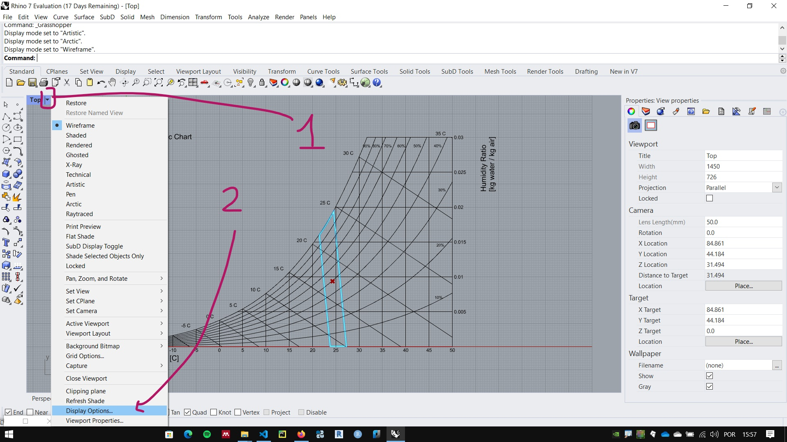
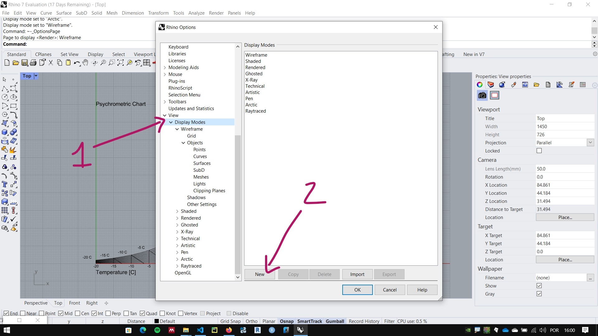
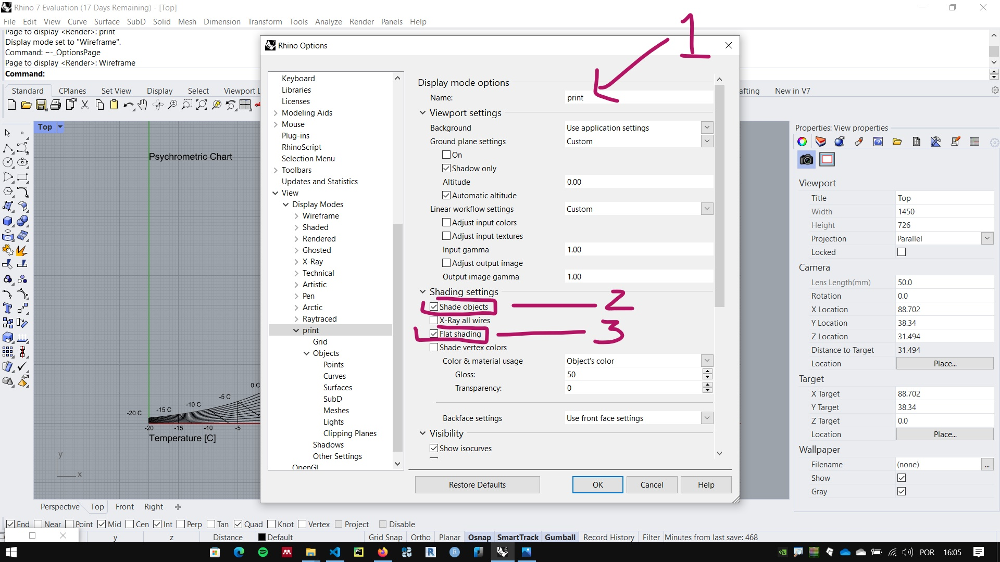
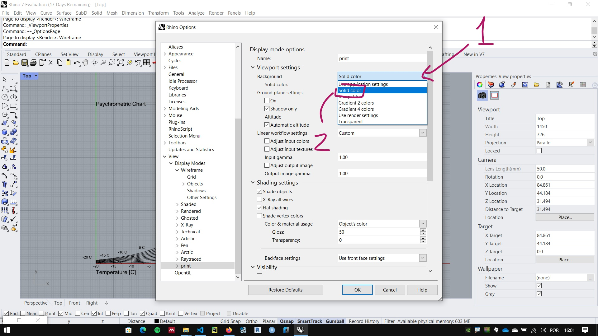
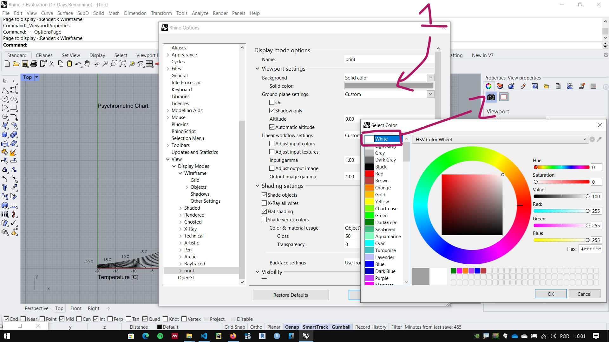
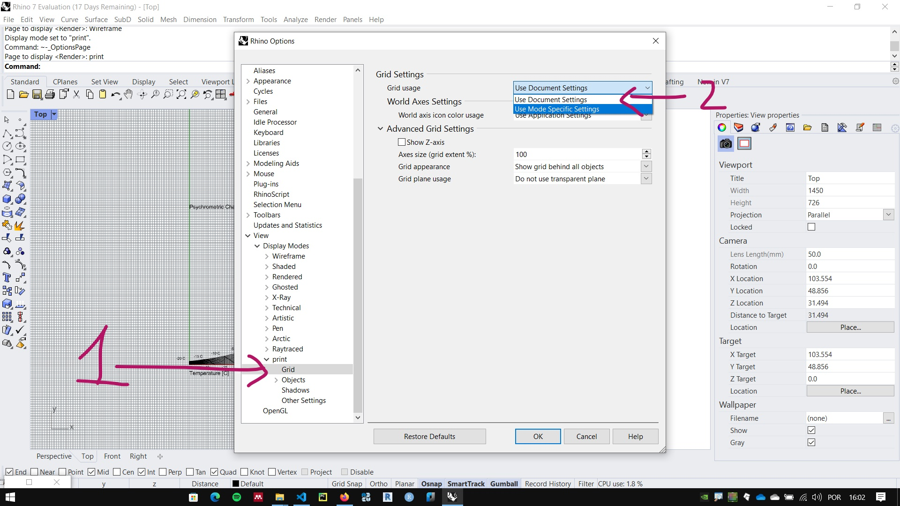
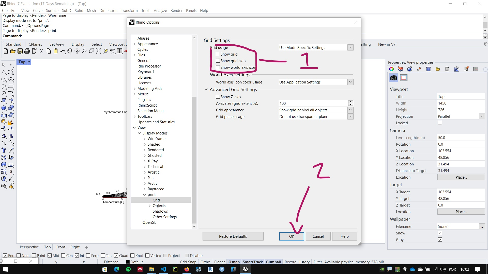
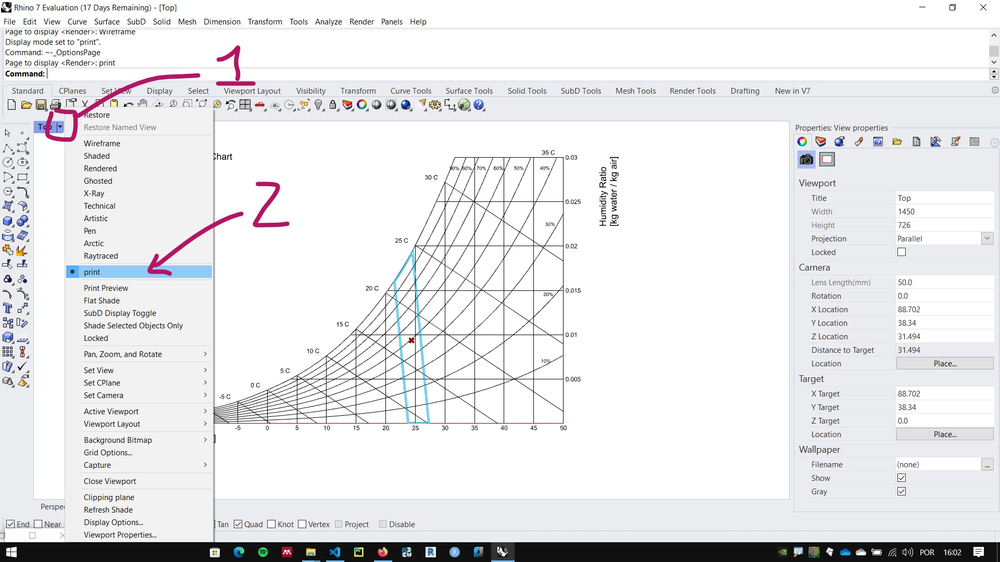
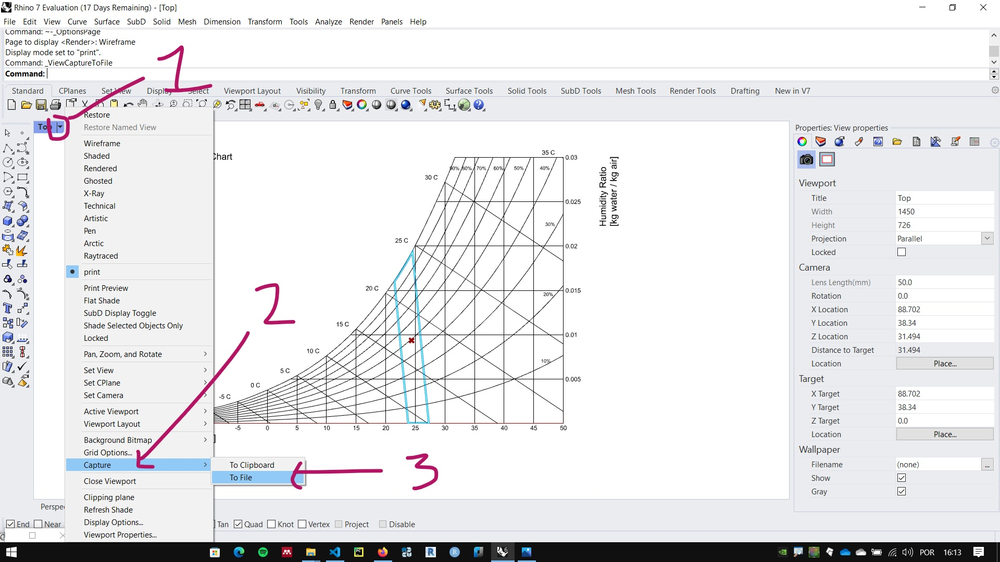
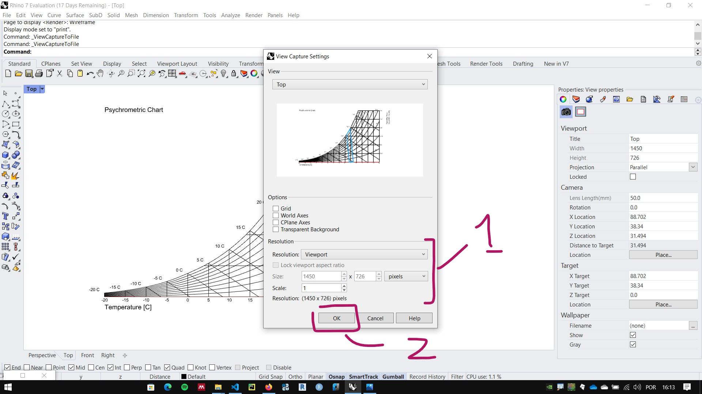

# Salvando imagens de tela do Rhinoceros e do Grasshopper

### Criando um novo modo de vista

As vezes é necessário configurar um modo de visualização (*display mode*) com características específicas para a exportação da imagem. 

Neste exemplo vamos criar uma cópia do **Display Mode** **Wireframe** e configurar para . Clique na seta ao lado do nome da vista e escolha a opção **Display Options**.

Em seguida, selecione a a opção **Display Modes** depois selecione o modo **Wireframe** e clique em **new**. 

Digite um nome para o seu novo modo, neste exemplo escolhemos o nome **print**. Marque as opções **shade objects** e  **fill shading**

Na configuração de **Background** selecione a opção **Solid Color**

Em seguida, clique para configurar uma cor branca para o fundo da **viewport** conforme figura abaixo.

No ajuste de visualização da malha para o **Display Mode** criado, ative a opção **Use mode specific settings**.

Desabilite as opções de malha para o modo de visualização. Clique em **OK** para finalizar a configuração.

## Selecionando o Display Mode configurado

Clique na seta ao lado do nome da vista, procure pelo nome escolhido para o **Display Mode** e selecione.

## Salvando uma vista do Rhinoceros

Clique na seta ao lado do nome da vista, selecione **Capture** em seguida selecione a opção **To File**.

Ajuste as opções de resolução e cique em **OK** para salvar a imagem.

## Salvando uma imagem de um algoritmo no Grasshopper.

1. No Grasshopper, va no menu File->Export hi-res image.

    

2. Na caixa de diálogo, clique nas reticências no canto superior direito da tela

    

3. Escolha a pasta e o nome que deseja dar ao arquivo. Clique em salvar

    

4. de volta a caixa de dialogo, clique em ok.

    

###### ATENÇÂO! Para cada nova imagem, o nome do arquivo tem que ser alterado clicando nas reticencias no canto superior direito da caixa de diálogo. Se não, o último arquivo salvo sobrescreve o anterior.

