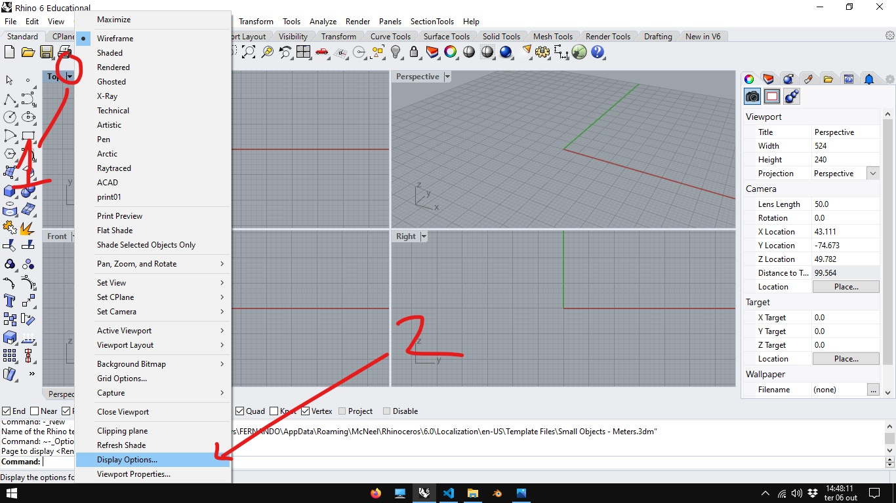
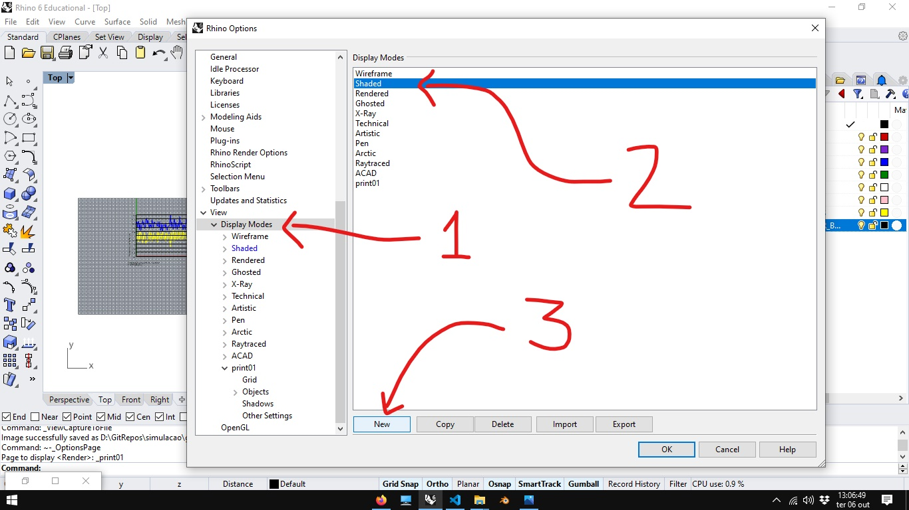
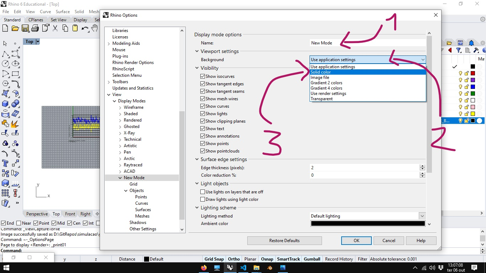
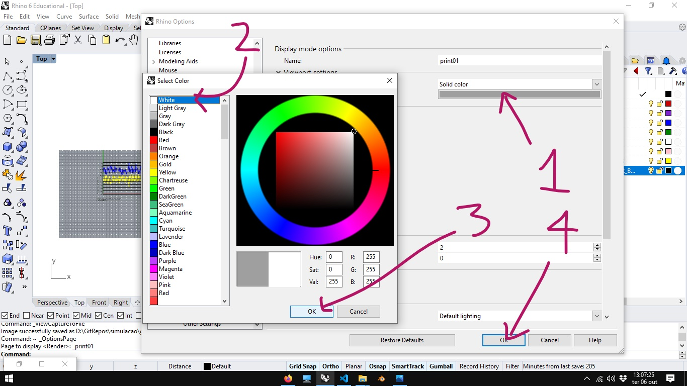
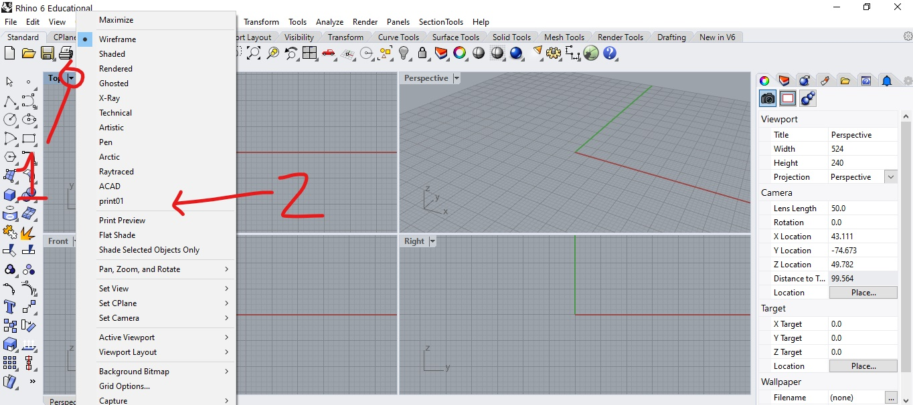
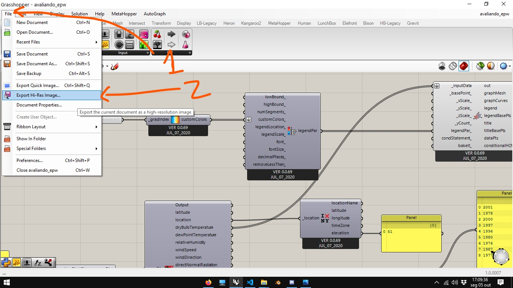

# Salvando imagens de tela no Rhinoceros e Grasshopper

## Salvando a Imagem de uma *viewport* no Rhinoceros

### Usando uma vista existente

1. Maximize a vista que deseja salvar.

2. Clique na seta ao lado no mome da vista.

3. Escolha um estilo de visualização para a imagem. (o estilo ***Artic*** pode ser uma boa escolha para os gráficos)

1. Clique novamente na seta ao lado no nome da **viewport** e escolha as opções
   1. Capture
   2. To File

1. Configure as oções de saída da imagem.

    1. Nome da vista que deseja capturar.
    2. Configurações dos eixos da imagem.
    3. Forato de saida (a opção custom permite ajustar as caracteristicas da imagem com maior precisão).
    4. Dimensões e DPI
    5. Salvar a imagem.

### Criando um novo modo de vista

As vezes é necessário configurar um modo de visualização (*display mode*) com características específicas para a exportação da imagem. 

Neste exemplo vamos criar uma cópia do **Display Mode** **sahded** com a cor do fundo em banco para facilitar a impressão. Clique na seta ao lado do nome da vista e escolha a opção **Display Options**.

Em seguida, selecione a a opção **Display Modes** depois selecione o modo **shaded** e clique em **new**. 

Digite umnome para o seu novo modo e, na configuração de Background, escolha a opção **solid color**.

Clique no botão que mostra a cor do backgound, em seguida, escolha a opção white. Clique em ok para confirmar a seleção da cor e, caso não queira fazer mais nenhum ajuste, clique em ok novamente, conforme indicado na figura abaixo:

Clicando na seta ao lado do nome da vista, é possível selecionar o novo modo de vista, selecionado o nome escolhido.

## Salvando uma imagem de um algoritmo no Grasshopper.

1. No Grasshopper, va no menu File->Export hi-res image.

    

1. Na caixa de diálogo, clique nas reticências mo canto superior direito da tela

    

2. Escolha a pasta e o nome que deseja dar ao arquivo. Clique em salvar

1. de volta a caixa de dialogo, clique em ok.

###### Para cada nova imagem, o nome do arquivo tem que ser alterado clicando nas reticencias no canto superior direito da caixa de diálogo. Se não, o último arquivo salvo sobrescreve o anterior.

