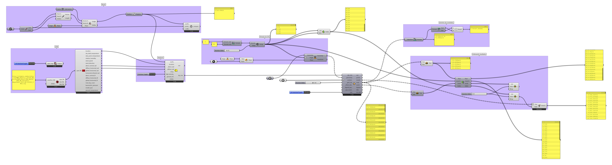

# Radiação nas superfícies

[Arquivo 3dm](RADIATION_EXEMPLO.3dm)

----------------------------------------

[ARQUIVO EXEMPLO 01](./rad_surfaces.gh)

-------------------------------------------

[ARQUIVO EXEMPLO 02](./rad_surfaces_multiple.gh)

-------------------------------------------

-------------------------------------------