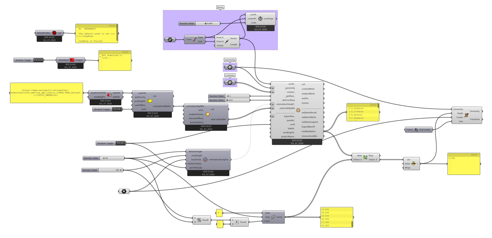

# Análise de radiação solar nas fachadas

Partindo do [arquivo final](./radiation_01.gh) do guia [Arquivo base para análise de radiação solar](./radiation.md). Utilizando o arquivo do [RADIATION_EXEMPLO.3dm](./RADIATION_EXEMPLO.3dm).

Selecione um componente **Ladybug_Radiation Analisys** e conecte a saída **select_SkyMtx** do componente Ladybug de mesmo nome na respectiva entrada. 

As configurações de **north\_**, **\_geometry**, **context\_**, **\_gridSize\_** e **_disFromBase** seguem a mesma lógica das respectivas confgurações realizadas no guia [Análise de horas de insolejamento](../sunpath/Analise_horas_de_sol.md). 

conectando um **Boolean Toogle** à entrada **_runIt** é possível rodar a simulação.

O resultado da análise aparece nas **Viewports** do Rhinoceros. É possível observar as fachadas por ângulos diferentes e avaliar os níveis de radiação pelo [diagrama de falsa cor](https://en.wikipedia.org/wiki/False_color).

______________
______________

[Arquivo Final](radiation_04.gh)
