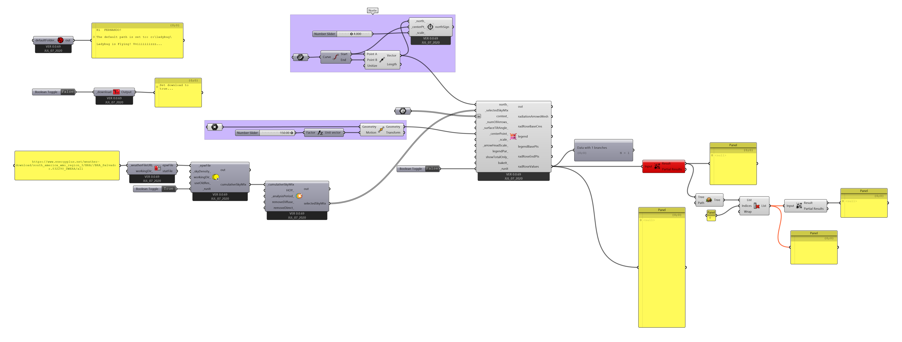

# Radiation Rose

Partindo do [arquivo final](./radiation_01.gh) do guia [Arquivo base para análise de radiação solar](./radiation.md). Utilizando o arquivo do [RADIATION_EXEMPLO.3dm](./RADIATION_EXEMPLO.3dm).

Abrindo o arquivo [radiation_01.gh](./radiation_01.gh), utilize o componente **Ladybug_Radiation Rose** conforme indicado na figura abaixo.

Três diguras indicando a origem dos raios de radiação são apresentadas. Da esquerda para a direita temos: radiação total, difusa e direta.

Em um projeto real, seria interessante colocar a direção do norte e levar em consideração o entorno nas análises.

Vamos usar o arquivo [RADIATION_EXEMPLO.3dm](./RADIATION_EXEMPLO.3dm) como modelo de entorno. 

