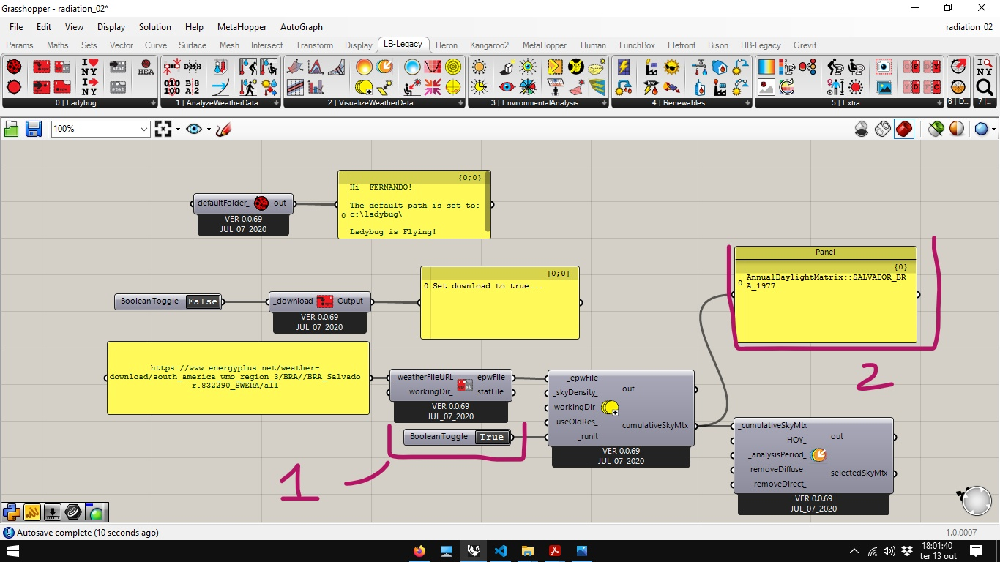
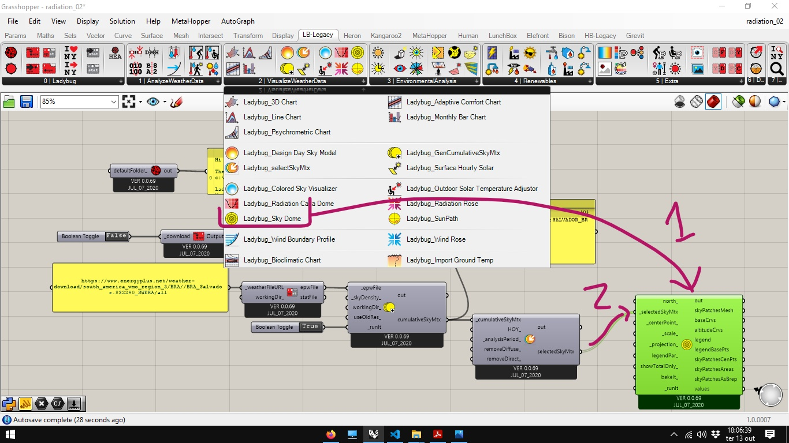
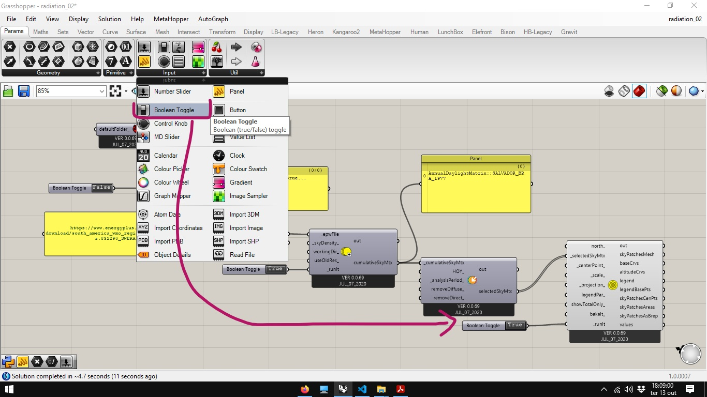
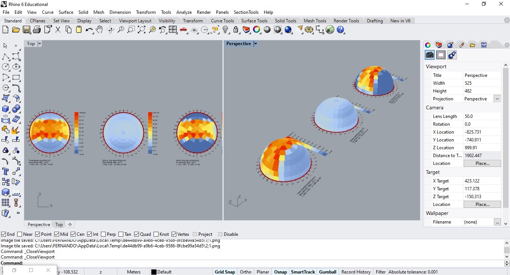
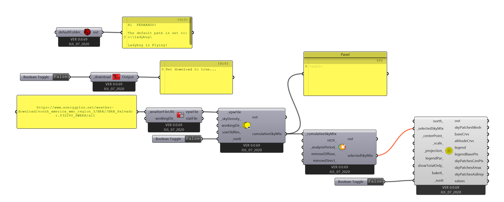

# SkyDome

Partindo do [arquivo final](./radiation_01.gh) do guia [Arquivo base para análise de radiação solar](./radiation.md).

Após abrir o arquivo e ajustar o **Boolean Toggle** para True, a não ser que esteja rodando um sistema muito potente, é preciso esperar um pouco até que a sky matrix seja gerada.

No entanto não podemos visualizar quase anda. Apenas uma mensagem na saída **cumulaticeSkyMtx** do componente **LadYbug_GenCumulativeSkyMtx**.

Para enteder o que é a matriz do céu, pode-se utilizar um componente **ladybug_Sky Dome**

Que também precisa de um **Boolean Toggle** ajustado com **True** para rodar.

Na janela do Rhinoceros, podemos ver três domos gerados pelo componente.

Estas são representações da Sky Matrix, uma matriz que representa a radiação solar proveniente de cada direção. Em um dos domos temos a radiação difusa, que representa a radiação solar dispersa na atmosfera, em outro a direta, vindo diretamente da posição do Sol. A total é a soma das duas anteriores.

Por padrão a Sky Matrix é calculada para o ano todo, mas pode ser ajustada pelo componente **Ladybug_ Analysis Period** ou pela saída **HOY** de um componente **Ladybug_DOY_HOY** (seção extras) para um período, dia ou hora especificado. 

___________________________
___________________________

[Arquivo final](./radiation_02.gh)

