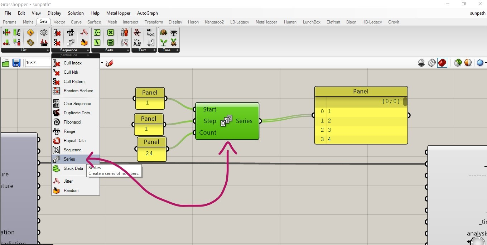
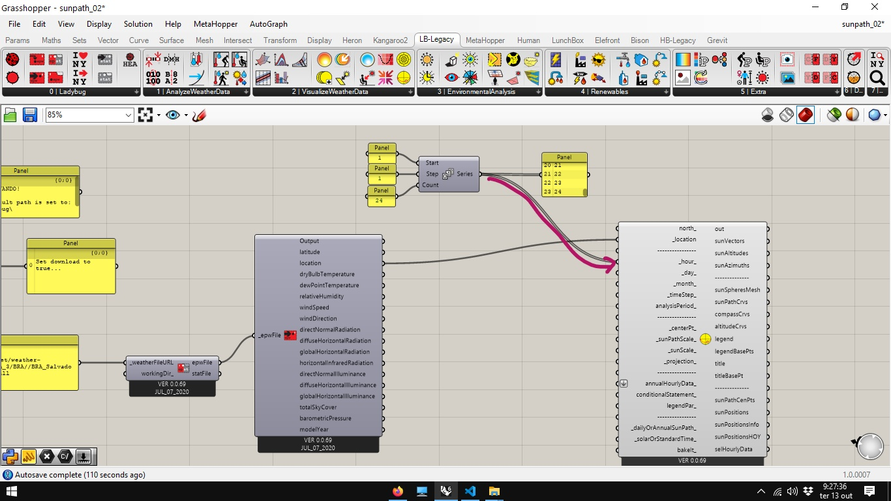
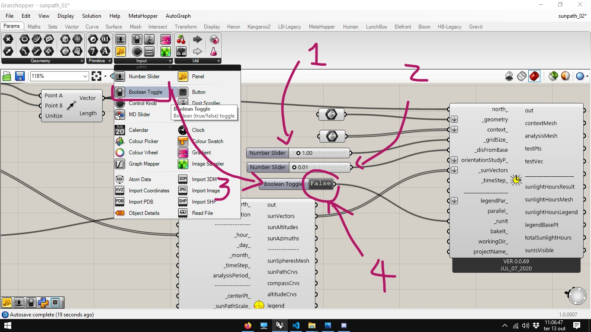
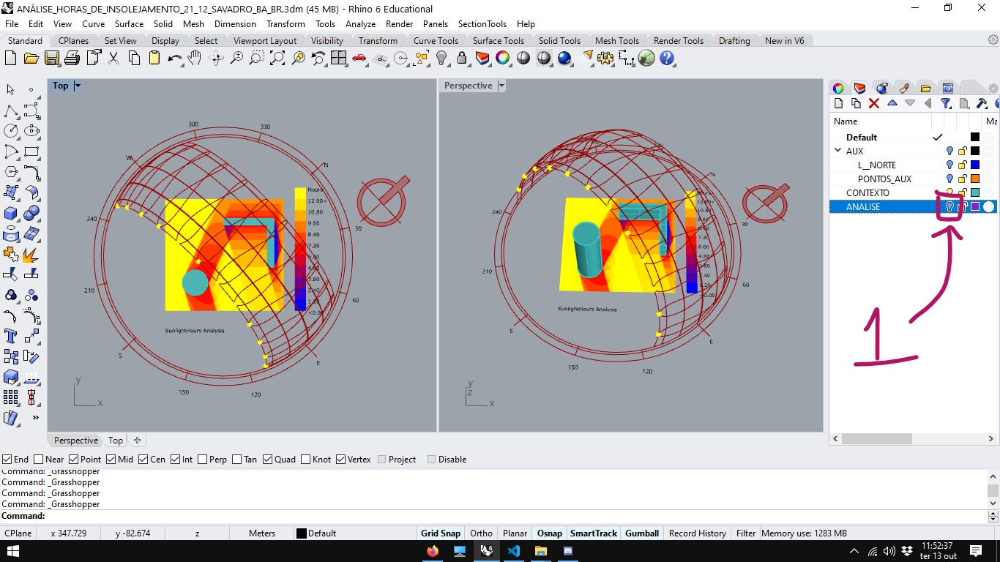
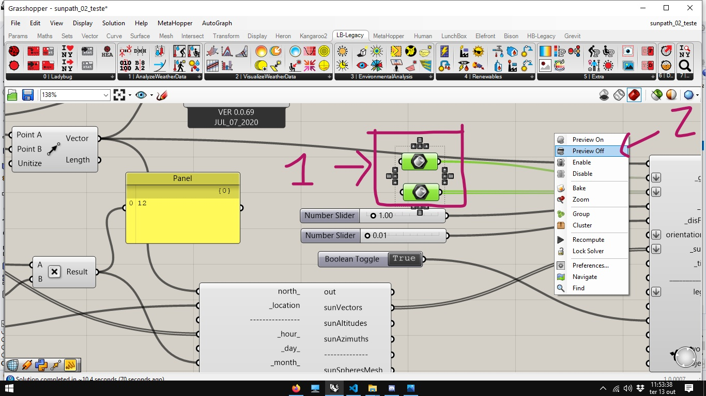

# Análise de insolejamento por horas de insolejamento.

Partindo do [arquivo final](../epw_arq/ladybug_epw.gh) do guia [Baixando Arquivos EPW e importando dados](../epw_arq/ladybug_epw.md). Utilizaremos o arquivo [SUNPATH_EXAMPLES.3dm](./SUNPATH_EXAMPLES.3dm) no Rhinoceros para simular uma análise com entorno.

No Rhinoceros, abra o arquivo [SUNPATH_EXAMPLES.3dm](./SUNPATH_EXAMPLES.3dm). No Gasshopper, abra o arquivo [ladybug_epw.gh](../epw_arq/ladybug_epw.gh)

Selecione o componente **Ladybug_Sun Path**.

Conecte a saída **location** do arquivo epw com a entrada **_location_** do componente **Ladybug_Sun Path**.

Configure um componente **Series** conforme figura abaixo.

E conecte com a entrada **_hours_** do componente **Ladybug_Sun Path**.

Assim , as posições do sol de hora em hora para o dia 21 de dezembro serão ostradas na tela do Rhino.

No arquivo de exemplo utilizado, o norte não está alinhado com o eixo Y, mas na direção de uma linha marcada no Layer L_NORTE. Ative a visualização dos layers auxiliares, ativando os ícones de lâmpadas indicados.

No Grasshopper, selecione um componete **Curve** na aba **Params**, seção **Geometry**.

clique com o botão direito no componente **Curve** e selecione a opção **select one curve**.

Selecione a linha do layer L_NORTE no Rhinoceros.

 De volta ao Grasshopper, selecione um componente **End Points** e conecte o componente **Curve** conforme figura abaixo:

Selecione um componente **Vector 2Pt** conecte as saídas do componente **End Points** e a saída vector na entrada **north_** conforme ilustrado.

Desabilite a visualização do layer L_NORTE.

No Grasshopper, selecione um componente **Ladybug_North** para visualizar uma indicação da direção do norte.

Em seguida, é possível desabilitar a visualização dos componentes **Curve** e **End Points**, selecionando ambos, clicando com o botão direito em um espaço vazio da tela do Grasshopper e escolhendo a opção **Preview Off** no menu.

Selecione um componente **Ladybug_Sunlight Hours Analysis**

Conecte a saída **sunVectors** do componente **Ladybug_Sun Path** na entrada **_sunVectors** do componente **Ladybug_Sunlight Hours Analysis** e se asegure que ambos os componentes estão com o mesmo vetor na entrada **north_**.

Através da aba **Params**, seção **Geometry**, crie dois componentes **Brep**. 

Em um deles, clique com o botão direito, selecione a opção **Set one Brep** e, na tela do Rhinoceros, selecione o plano no layrer ANALISE.

No outro, Clique com o botão direito, escolha o opção **Set multiple Breps** e, na tela do Rhinoceros, selecione os volumes no Layer CONTEXTO.

Conecte o primeiro an entrada **\_geometry** e o segundo na entrada **context_** do componente **Ladybug_Sunlight Hours Analysis**.

Mais 3 componentes obrigatórios devem ser ajustados para realizar a análise: **\_gridSize\_**, **\_disFromBase** e **\_runIt**. 

O **\_gridSize\_** representa o tamanho da malha de pontos que será testada sobre as superfícies da entrada **\_geometry**. Quando menor o valor, mais preciso será o cálculo e maior será o peso computacional da análise. Para o Exemplo proposto, aconselha-se o valor de 1.

O parâmetro **\_disFromBase** representa uma distância das superfícies da entrada **\_geometry** onde serão realizadas as medições, recomenda-se um valor pequeno como 0.01.

A entrada **\_runIt** recebe um **Boolean Toggle** que deve ser ajustado para True apenas quando todas as outras entradas estiverem preparadas.

A análise já aparece na tela do Rhinoceros. Para melhor leitura deve-se desabilitar a visualização dos Layers ANALISE e CONTEXTO.

No Grasshopper, desabilite o **Preview** do componente **Brep** ligado a entrda **\_geometry** do componente **Ladybug_Sunlight Hours Analysis**.

Para refinar a análise, primeiro ajuste para **False** o valor do **Boolean Toggle** ligado à entrada **\_runIt**. Em seguida conecte um componente **Ladybug_Legend Parameters** na entrada **legendPar_** do componente **Ladybug_Sunlight Hours Analysis**.

Conecte um componente **Ladibug_Gradiente Library** na entrada **customColors_** do componente **Ladybug_Legend Parameters**.

Ajuste o valor de entrada do componente **Ladibug_Gradiente Library** para 16.

Refaça a análise, ajustando o **Boolean Toggle** ligado à entrada **\_runIt** para **True**.

__________________________
[ARQUIVO FINAL GH](./sunpath02.gh)

[ARQUIVO RHINO BAKE](./ANÁLISE_HORAS_DE_INSOLEJAMENTO_21_12_SAVADRO_BA_BR.3dm)

