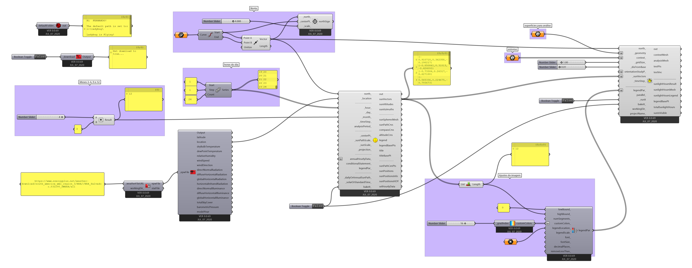

# Análise de insolejamento por horas de insolejamento.

Partindo do [arquivo final](./sunpath.gh) do guia [Percurso aparente do Sol](./Percurso_aparente_do_Sol.md). Utilizaremos o arquivo [SUNPATH_EXAMPLES.3dm](./SUNPATH_EXAMPLES.3dm) no Rhinoceros para simular uma análise com entorno.

No Rhinoceros, abra o arquivo [SUNPATH_EXAMPLES.3dm](./SUNPATH_EXAMPLES.3dm). No Gasshopper, abra o arquivo [sunpath.gh](./sunpath.gh).

Desconecte o componente **Ladybug_Analysis Period** da entrada **analysisPeriod_** e a saída **dryBulbteperature** da entrada **annualHourlyData_**. Apague com componente **Point** que está conectado à entrada **_centerPt_** do componente **Ladybug_Sun Path**. Mova o componente **Ladybug_Analysis Period** e os **Sliders** e o **Panel** conectado à este, conforme figura abaixo.

[ARQUIVO FINAL GH](./sunpath_DAYL_LIGHT_HOURS_ANALISE_FINAL.gh)

[ARQUIVO RHINO BAKE](./ANÁLISE_HORAS_DE_INSOLEJAMENTO_21_12_SAVADRO_BA_BR.3dm)