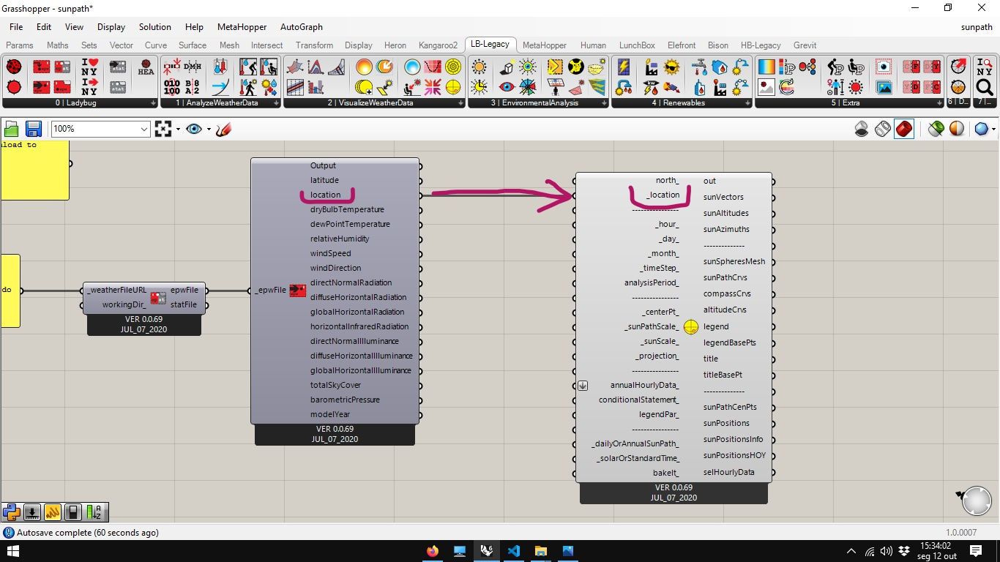

# Percurso Aparente do Sol

Partindo do [arquivo final](../epw_arq/ladybug_epw.gh) do guia [Baixando Arquivos EPW e importando dados](../epw_arq/ladybug_epw.md).

Selecione o componente **Ladybug_Sun Path**.

Conecte a saída **location** do arquivo epw com a entrada **_location_** do componente **Ladybug_Sun Path**.

O percurso aparente do sol já pode ser visto nas janelas do Rhinoceros.

Alguns aspectos do componente **Ladybug_Sun Path** podem ser ajustados nas entradas indicadas abaixo.

Para mudar o ponto central do diagrama, insira um ponto no rhino:

clique na tela ou digite as coordenadas

No Grasshopper, selecione um componente **Point**

Clique com o botão direito no centro do componente **Point** e selecione a opção **Set one Point**.

Na tela do rhino, mude o tipo de seleção de **Coorrdinate** para **Point**

Em seguida, clique no ponto desenhado.

