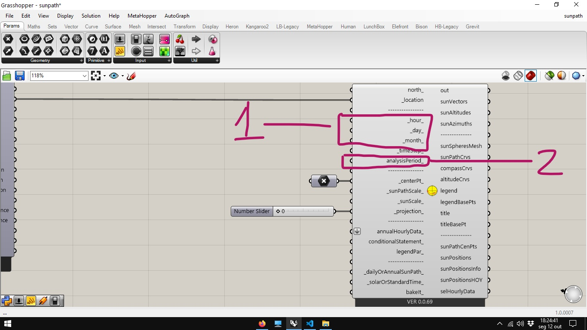
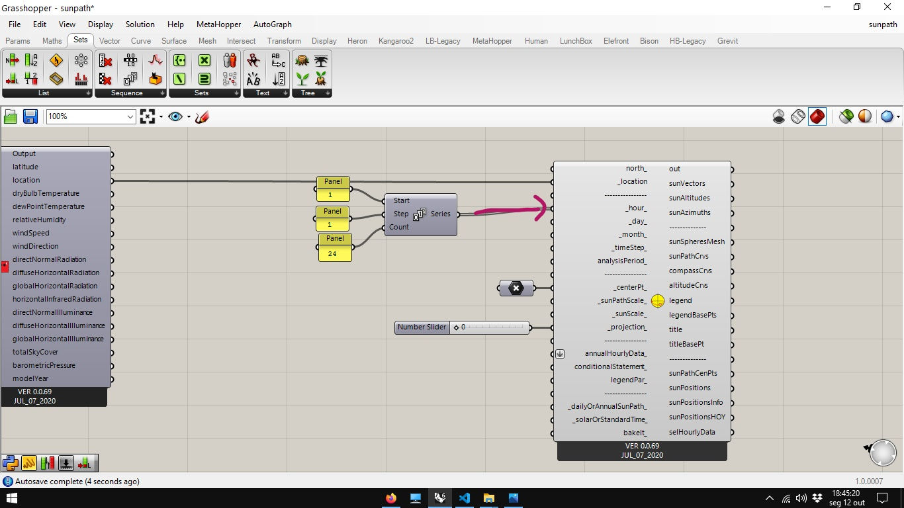
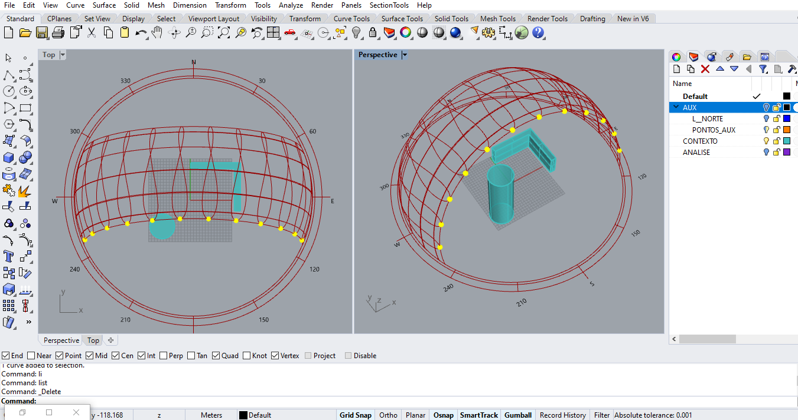
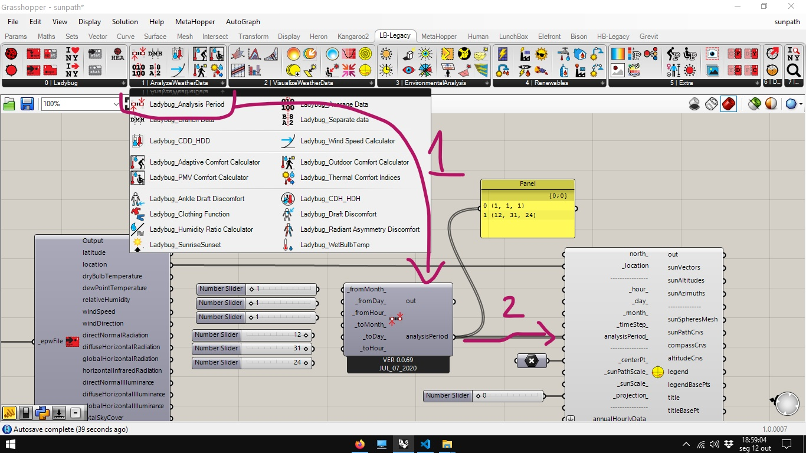
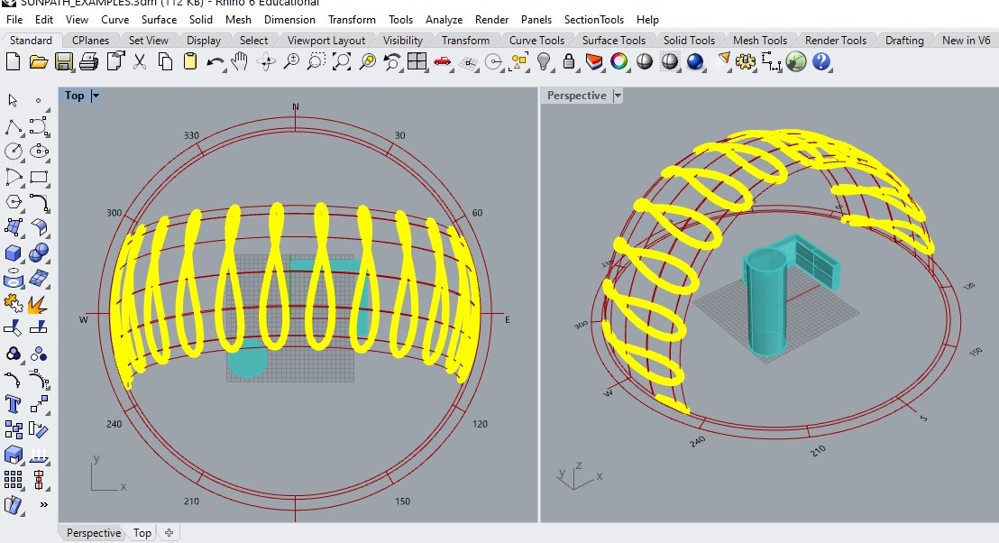
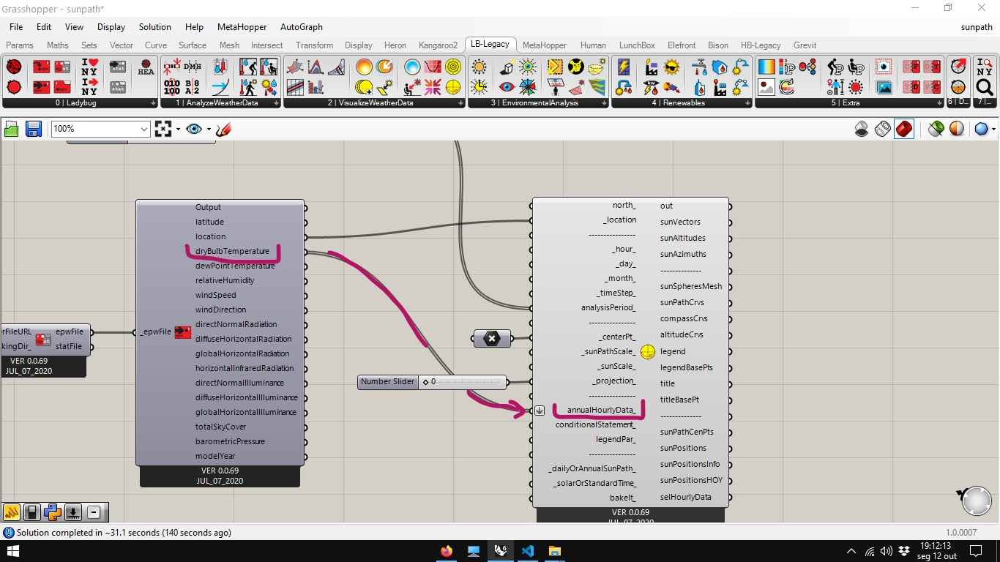
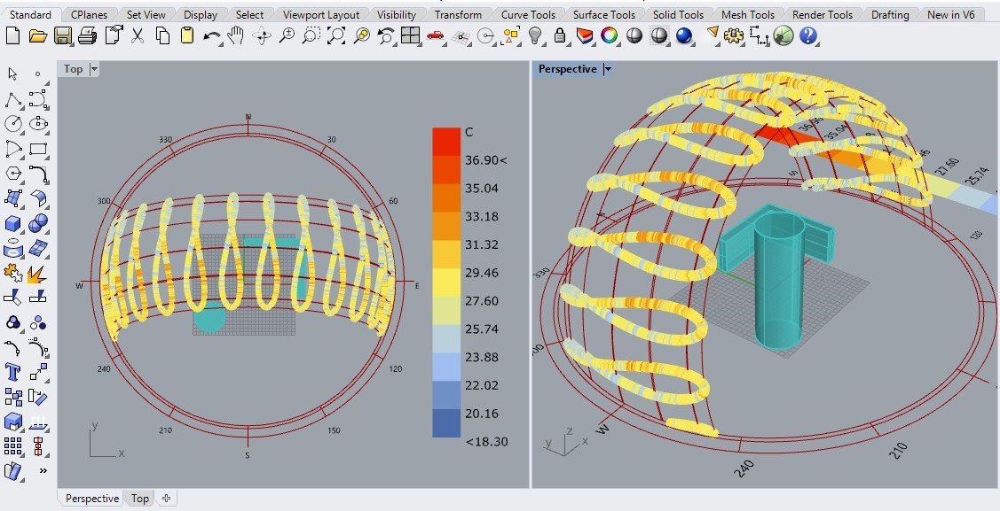
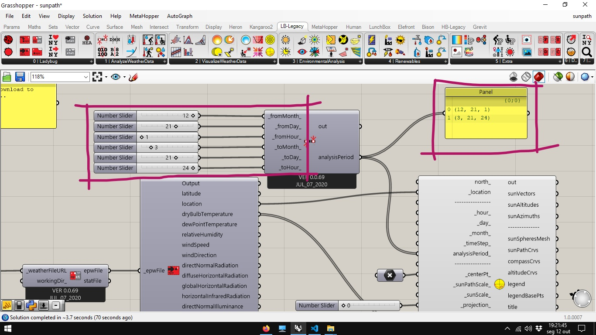
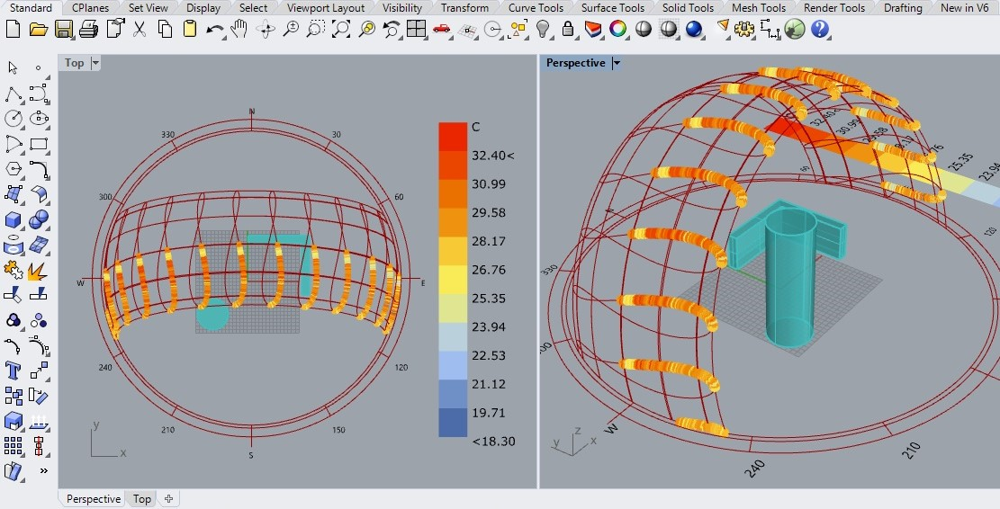
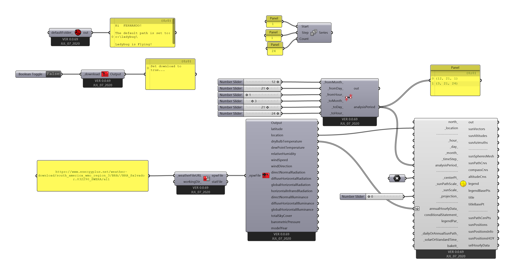

# Percurso Aparente do Sol

Partindo do [arquivo final](../epw_arq/ladybug_epw.gh) do guia [Baixando Arquivos EPW e importando dados](../epw_arq/ladybug_epw.md).

Selecione o componente **Ladybug_Sun Path**.

Conecte a saída **location** do arquivo epw com a entrada **_location_** do componente **Ladybug_Sun Path**.

O percurso aparente do sol já pode ser visto nas janelas do Rhinoceros. Apresentando círculos com os pontos cardeais e ângulos em relação ao norte. Os arcos com alguns dos percursos diários do Sol e os [analemas](https://pt.wikipedia.org/wiki/Analema) de hora em hora.

Alguns aspectos do componente **Ladybug_Sun Path** podem ser ajustados nas entradas indicadas abaixo.

Para mudar o ponto central do diagrama, insira um ponto no rhino:

clique na tela ou digite as coordenadas

No Grasshopper, selecione um componente **Point**

Clique com o botão direito no centro do componente **Point** e selecione a opção **Set one Point**.

Na tela do rhino, mude o tipo de seleção de **Coorrdinate** para **Point**

Em seguida, clique no ponto desenhado. Voltando para a tela do Grasshopper, conecte o componente **Point** na entrada **_centerPt_** do componente **Ladybug_Sun Path**.

As entradas **_sunpPathScale_** e **_sunScale_** recebem valores numéricos reais que controlam os tamanhos do diagrama e das marcações da posição do sol respectivamente.

A entrada **_projection_** recebe valores inteiros entre 0 e 2. 

O valor 0 é o padrão e gera o gráfico tridimensional.

O valor 1 gera uma projeção ortogonal do diagrama sob o Plano XY. Funciona para alguns gráficos gerados a partir da posição do Sol.

O valor 2 gera a projeção estereográfica do percurso anual do Sol. Utilizada nas cartas solares.

As datas e horários do diagrama podem ser ajustados de duas maneiras: Pelas entradas de dia, mês e ano (**_hour_**, **_day_** e **_month_**), ou pela entrada **analysisPeriod_**.

As entradas **_hour_**, **_day_** e **_month_** aceita respectivamente valores entre 1 e 24, 1 e 31 e 1 e 12. O valor padrão das entradas corresponde a 12 21 12, aproximadamente o [solstício de verão](https://pt.wikipedia.org/wiki/Solst%C3%ADcio) do hemisfério sul.

Os valores podem ser inseridos por **Sliders**, ou por listas de valores. Um componente **Series**, por exemplo, pode gerar uma lista de valores indo de 1 até 24 com a configuração abaixo:

Conectando a série à entrada de **_hours_** do componente **Ladybug_Sun Path**...

Aparecem as posições do Sol de hora em hora, no dia 21 de Dezembro, para a latitude e longitude fornecidas pela saída **_location__** do arquivo EPW.

Pare analisar períodos seguidos, o componente **Ladybug_Analysis Perido** é bastante útil. Por padrão, esta ajustado para o ano inteiro, Da hora 1 do dia 1º de janeiro á jora 24 do dia 31 de Dezembro.

Gerando as múltiplas posições do sol na tela do Rhinoceros.

Essas posições podem ser usadas para gerar gráficos dos dados climáticos armazenados no arquivo EPW. No exemplo abaixo, a saída **dryBulbTemperature** do arquivo EPW é conectada à entrada **annualHourlyData_**.

No Rhinoceros, as posições do Sol são visualizadas com uma escala de cores representando os valores de temperatura correspondentes à cada hora.

Os períodos de análise pode ser ajustados com **Sliders**. No exemplo abaixo, os valores foram ajustados para o período do verão.

Gerando o gráfico abaixo na tela do Rhinoceros.

[Arquivo Final](./sunpath.gh)

